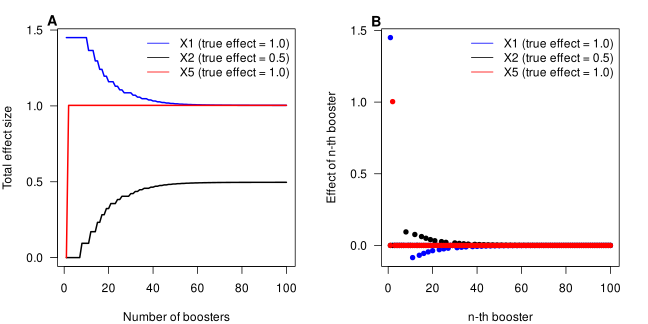
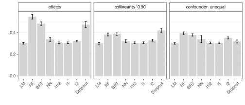

::: {.cell}

:::


**Summary:** This document provides supporting information on Pichler & Hartig -- Can machine learning be used for causal inference.

## Boosting and regression trees

### Unbiasedness

Random forest (RF) and boosted regression trees (BRT) showed bias in both scenarios, with and without collinearity, raising the question of whether the bias is caused by the boosting/bagging or the regression trees themselves. For RF, we know that the observed spillover effect is caused by the random subsampling (mtry parameter) in the algorithm, which explains the bias.

For BRT, however, it is unclear what is causing the bias (boosting or regression trees) because each member in the ensemble is always presented with all predictors (at least with the default hyperparameters, the BRT implementation in xgboost has options to use bootstrap samples for each tree and also subsamples of columns in each tree (or node), see @chen2016xgboost).

To understand how boosting and regression trees affect effect estimates, we simulated three different scenarios (Fig. S1, first column) without collinearity (Fig. S1a) and with collinearity (Fig. S1a, b) (we sampled 1000 observations from each data generating model (Fig. S1, first column) and estimated effects using ACE (100 repititions)).


::: {.cell}

:::

::: {.cell}
::: {.cell-output-display}
![Bias on effect estimates for different ML algorithms (LM = liner regression model (OLS), RT LC = regression tree with low complexity (depth), RT HC = regression tree with high complexity, Linear Booster, Tree Booster LC = tree booster with low complexity, Tree Booster HC = tree boster with high complexity) in three different simulated causal scenarios (a, b, and c). Sample sizes are so large that stochastic effects can be excluded (1000 observations). Effects of the ML models were inferred using average conditional effects. Row a) shows results for simulations with uncorrelated predictors with the true effect sizes . Row b) shows the results for simulations with X~1~ and X~2~ being strongly correlated (Pearson correlation factor = 0.9) but only X~1~ has an effect on y (mediator) and row c) shows the results for X~1~ and X~2~ being strongly correlated (Pearson correlation factor = 0.9) with X~1~ and X~2~ having effects on Y (confounder scenario).](plots/fig-Fig_S1-1.svg){#fig-Fig_S1}
:::
:::


We found that the regression tree (RT) is unable to estimate unbiased effects (Fig. S1), regardless of the presence or absence of collinearity or the complexity of the RT (depth of the regression trees). Without collinearity, effects in regression trees were biased toward zero, less so with higher complexity (Fig. S1). With collinearity, there was a small spillover effect for the RT with high complexity (Fig. S1b) to the collinear zero effect (X~2~), similar to an l2 regularization. When the collinear predictor (X~2~) had an effect (Fig. S1c), we found a stronger absolute bias for the smaller of the two collinear effects (X~2~), confirming our expectation that RTs show a greedy effect. This greedy behavior was particularly strong for the low complexity RT (Fig. S1c).

To answer the question of how boosting affects the greediness and spillover effects of RT, we first investigated the behavior of a linear booster because of the well-known behavior of OLS under collinearity. And indeed, we found that the linear booster was unbiased in all three scenarios (compare LM and linear booster in Fig. S1), showing that boosting itself can produce unbiased effects.

Now, comparing the vanilla BRTs with low and high complexity (depth of individual trees) with the linear booster and the RTs, we found similar biases as for the RTs, in terms of spillover with a collinear zero effect and the greediness effect in the presence of a weaker collinear effect (Fig. S1).

### Understanding boosting

Intuitive boosting shouldn't work because it's basically a regression of residuals. That is, and in the case of collinearity, the stronger of two collinear predictors in the first model would absorb the effect of the weaker second predictor that, for example, causes the omitted variable bias (the effect of the missing confounder is absorbed by the collinear effect).


::: {.cell}

:::

::: {.cell}
::: {.cell-output-display}
{#fig-Fig_S2}
:::
:::


Looking at the evolution of the total effect within a linear booster model (Fig. S2a), we found indeed that the first members of the ensemble absorb the effect of the collinear effect (effect of X~1~ is absorbed by X1, Fig. S2a), but as members are added to the ensemble, the collinear effect (X2) slowly recovers the effect of the stronger collinear effect until both are at their correct effect estimate (Fig. S2a). This retrieval works by reversing the sign of each member's effect, so that X1, which initially has an effect of 1.5 (because it absorbed the effect of X2), has small negative effects in subsequent trees, while X2, which is initially estimated at 0, has small positive effects (Fig. S2b).


## Proof of concept - Additional results

### Addtional scenarios


::: {.cell}

:::

::: {.cell}
::: {.cell-output-display}
![Bias on effect estimates for different ML algorithms in trhee different simulated causal simulations (a, b, and c). Sample sizes are so large that stochastic effects can be excluded (1000 observations). Effects of the ML models were inferred using average conditional effects. Row a) shows the results for simulations with X~1~ and X~2~ being strongly correlated (Pearson correlation factor = 0.99) but only X~1~ has an effect on y. Row b) shows results for simulations with with predictors (Pearson correlation factor = 0.5) with effect sizes (X~1~: 1.0, X~2~: 0.5, X~3~: 1.0) and row c) shows results for simulations with with predictors (Pearson correlation factor = 0.5) with effect sizes (X~1~: 1.0, X~2~: -0.5, X~3~: 1.0) ](plots/fig-Fig_S3-1.svg){#fig-Fig_S3}
:::
:::


### Additonal models 


::: {.cell}
::: {.cell-output-display}
![Bias on effect estimates for different ML algorithms in two different simulated causal simulations (a and b). Sample sizes are so large that stochastic effects can be excluded. Effects of the ML models were inferred using average conditional effects. Row a) shows results for simulations with with predictors (Pearson correlation factor = 0.5) with effect sizes (X~1~: 1.0, X~2~: -0.5, X~3~: 1.0). Row b) shows the results for simulations with X~1~ and X~2~ being strongly correlated (Pearson correlation factor = 0.99) but only X~1~ has an effect on y. ](plots/fig-Fig_S4-1.svg){#fig-Fig_S4}
:::
:::


## Hyperparameter tuning

We performed a hyperparameter search to check if and how hyperparameters influence differently or equally effect estimates and the prediction error, so does a model tune after the prediction error has biased effects? For that, we created simulation scenarios with 50, 100, 600, and 2000 observations and 100 predictors with effects ($beta_i, i = 1,...,100$) $\beta_1 = 1.0$, and $\beta_2$ to $\beta_3$ were equally spaced between 0.0 to 1.0 so that $\beta_2 = 0.0$ and $\beta_{100} = 1.0$.

predictors were sampled from a multivariate normal distribution and all predictors were randomly correlated (Variance-covariance matrix $\Sigma$ was sampled from a LKJ-distribution with $\eta = 2.0$.

1,000 combinations of hyper-parameters were randomly drawn (Table S1). For each draw of hyperparameters, the data simulation and model fitting was repeated 20 times. Effect sizes of X~1~ and X~2~ were recorded (for each hyperparameter combination and for each reptition). Moreover, bias, variance, and mean square error (MSE) were recorded for the predictions on a holdout of the same size as the training data.

| Algorithm               | Hyper-parameter       | Range                                             |
|-------------------|-------------------|----------------------------------|
| Neural Network          | activation function   | \[relu, leaky_relu, tanh, selu, elu, celu, gelu\] |
|                         | depth                 | \[1, 8\]                                          |
|                         | width                 | \[2, 50\]                                         |
|                         | batch size (sgd)      | \[1, 100\] in percent                             |
|                         | lambda                | \[2.65e-05, 0.16\]                                |
|                         | alpha                 | \[0, 1.0\]                                        |
| Boosted Regression Tree | eta                   | \[0.01, 0.4\]                                     |
|                         | max depth             | \[2, 25\]                                         |
|                         | subsample             | \[0.5, 1\]                                        |
|                         | max tree              | \[30, 125\]                                       |
|                         | lambda                | \[1, 20\]                                         |
| Random Forest           | mtry                  | \[0, 1\] in percent                               |
|                         | min node size         | \[2, 70\]                                         |
|                         | max depth             | \[2, 50\]                                         |
|                         | regularization factor | \[0, 1\]                                          |
| Elastic net             | alpha                 | \[0, 1.0\]                                        |
|                         | lambda                | \[0, 1.0\]                                        |

: Overview over hyper-parameters for Neural Network, Boosted Regression Tree, and Random Forest {#tbl-Hyper}

### Results hyperparameter tuning


::: {.cell}
::: {.cell-output-display}
![Results of hyperparameter tuning for Neural Networks (NN), Boosted Regression Trees (BRT), Random Forests (RF), and Elastic Net (EN) for 50 observations with 100 predictors. The influence of the hyperparameters on effect $\hat{\beta}_1$ (bias, variance, and MSE)(true simulated effect $\beta_1 = 1.0$  ) and the predictions, $\hat{y}$ of the model (bias, variance, and MSE) were estimated by a multivariate generalized additive model (GAM). Categorical hyperparameters (activation function in NN) were estimated as fixed effects. The responses (bias, variance, MSE) were centered so that the categorical hyperparameters correspond to the intercepts. The variable importance of the hyperparameters was estimated by a random forest with the MSE of the effect $\hat{\beta}_1$ (first plot) or the prediction $\hat{y}$ (second plot) as the response. Red dots correspond to the best predicted set of hyperparameters (based on a random forest), in the first plot for the minimum MSE of the effect $\hat{\beta}_1$ and in the second plot for the minimum MSE of the predictions $\hat{y}$.](plots/fig-Fig_S5-1.svg){#fig-Fig_S5}
:::
:::

::: {.cell}
::: {.cell-output-display}
![Results of hyperparameter tuning for Neural Networks (NN), Boosted Regression Trees (BRT), Random Forests (RF), and Elastic Net (EN) for 600 observations with 100 predictors. The influence of the hyperparameters on effect $\hat{\beta}_1$ (bias, variance, and MSE)(true simulated effect $\beta_1 = 1.0$  ) and the predictions, $\hat{y}$ of the model (bias, variance, and MSE) were estimated by a multivariate generalized additive model (GAM). Categorical hyperparameters (activation function in NN) were estimated as fixed effects. The responses (bias, variance, MSE) were centered so that the categorical hyperparameters correspond to the intercepts. The variable importance of the hyperparameters was estimated by a random forest with the MSE of the effect $\hat{\beta}_1$ (first plot) or the prediction $\hat{y}$ (second plot) as the response. Red dots correspond to the best predicted set of hyperparameters (based on a random forest), in the first plot for the minimum MSE of the effect $\hat{\beta}_1$ and in the second plot for the minimum MSE of the predictions $\hat{y}$.](plots/fig-Fig_S6-1.svg){#fig-Fig_S6}
:::
:::

::: {.cell}
::: {.cell-output-display}
![Results of hyperparameter tuning for Neural Networks (NN), Boosted Regression Trees (BRT), Random Forests (RF), and Elastic Net (EN) for 2000 observations with 100 predictors. The influence of the hyperparameters on effect $\hat{\beta}_1$ (bias, variance, and MSE)(true simulated effect $\beta_1 = 1.0$  ) and the predictions, $\hat{y}$ of the model (bias, variance, and MSE) were estimated by a multivariate generalized additive model (GAM). Categorical hyperparameters (activation function in NN) were estimated as fixed effects. The responses (bias, variance, MSE) were centered so that the categorical hyperparameters correspond to the intercepts. The variable importance of the hyperparameters was estimated by a random forest with the MSE of the effect $\hat{\beta}_1$ (first plot) or the prediction $\hat{y}$ (second plot) as the response. Red dots correspond to the best predicted set of hyperparameters (based on a random forest), in the first plot for the minimum MSE of the effect $\hat{\beta}_1$ and in the second plot for the minimum MSE of the predictions $\hat{y}$.](plots/fig-Fig_S7-1.svg){#fig-Fig_S7}
:::
:::


### Optimal hyperparameters

The hyperparameters were chosen based on the lowest MSE for the predictive performance of the models (Table S2) and the lowest MSE for the effect ($\beta_1$) on X~1~ (Table S3). The selection of the best hyperparameters was done by first fitting a random forest (default parameters) with the MSE as response and the hyperparameters as predictors, and then using the set of hyperparameters that predicted the lowest MSE. 


::: {.cell}

:::


| Algorithm | Hyperparameter | n = 50 | n = 100 | n = 600 | n = 2000 |
|-----------|-----------|-----------|-----------|-----------|-----------|
| NN | activations | celu | selu | selu | selu | 
|   | sgd | 0.944 | 0.348 | 0.098 | 0.098 | 
|   | depth | 1 | 1 | 1 | 1 | 
|   | width | 24 | 20 | 35 | 35 | 
|   | alpha | 0.939 | 0.821 | 0.693 | 0.693 | 
|   | lambda | 0.003 | 0.02 | 0.019 | 0.019 | 
| BRT | eta | 0.072 | 0.126 | 0.245 | 0.147 | 
|   | max_depth | 2 | 2 | 2 | 4 | 
|   | subsample | 0.666 | 0.511 | 0.77 | 0.57 | 
|   | lambda | 9.073 | 8.888 | 8.21 | 4.556 | 
|   | max_tree | 117 | 109 | 110 | 114 | 
| RF | mtry | 0.129 | 0.466 | 0.792 | 0.603 | 
|   | min.node.size | 12 | 2 | 3 | 6 | 
|   | max.depth | 21 | 19 | 47 | 30 | 
|   | regularization.factor | 0.914 | 0.874 | 0.736 | 0.615 | 
| EN | alpha | 0.007 | 0.008 | 0.025 | 0.025 | 
|   | lambda | 0.286 | 0.028 | 0.006 | 0.006 | 


: Best predicted set of hyperparameterfor ML algorithms (tuned after MSE of predictions) {#tbl-Hyper_selected_pred}

| Algorithm | Hyperparameter | n = 50 | n = 100 | n = 600 | n = 2000 |
|-----------|-----------|-----------|-----------|-----------|-----------|
| NN | activations | selu | selu | selu | selu | 
|   | sgd | 0.391 | 0.395 | 0.112 | 0.175 | 
|   | depth | 3 | 3 | 2 | 2 | 
|   | width | 18 | 40 | 19 | 39 | 
|   | alpha | 0.135 | 0.613 | 0.332 | 0.498 | 
|   | lambda | 0.009 | 0.011 | 0.002 | 0.006 | 
| BRT | eta | 0.252 | 0.327 | 0.393 | 0.393 | 
|   | max_depth | 11 | 17 | 3 | 3 | 
|   | subsample | 0.514 | 0.584 | 0.523 | 0.523 | 
|   | lambda | 9.051 | 7.779 | 9.053 | 9.053 | 
|   | max_tree | 71 | 102 | 124 | 124 | 
| RF | mtry | 0.137 | 0.926 | 0.462 | 0.952 | 
|   | min.node.size | 2 | 4 | 9 | 12 | 
|   | max.depth | 31 | 29 | 29 | 36 | 
|   | regularization.factor | 0.683 | 0.894 | 0.587 | 0.566 | 
| EN | alpha | 0.011 | 0 | 0.011 | 0.011 | 
|   | lambda | 0.016 | 0.018 | 0.009 | 0.009 | 


: Best predicted set of hyperparameterfor ML algorithms (tuned after MSE of effect X~1~) {#tbl-Hyper_selected_eff}

## Additional results for data-poor scenarios

### Prediction error of scenarios


::: {.cell}

:::

::: {.cell}
::: {.cell-output-display}
{#fig-Fig_S8}
:::
:::


## Data-poor scenarios without collinearity

### Bias and variance of effects


::: {.cell}

:::

::: {.cell}
::: {.cell-output-display}
![Bias and variance of estimated effects in data-poor situations. N = 50, 100, and 600 observations of 100 weakly correlated predictors were simulated. The effects of X~1~ and X~2~ were 1.0 and 0.0. The other 98 effects were equally spaced between 0 and 1. Models were fitted to the simulated data (1000 repititions) with the optimal hyperparameters (except for LM, which doesn't have hyperparameters). Hyperparameters were chosen based on the minimum MSE of an effect (green) or the prediction error (red). Bias and variance were calculated for X~1~ and X~2~. Effects were approximated using ACE.](plots/fig-Fig_S9-1.svg){#fig-Fig_S9}
:::
:::


### Prediction error of scenarios


::: {.cell}

:::

::: {.cell}
::: {.cell-output-display}
{#fig-Fig_S10}
:::
:::


## Proof of concept - Inferring interactions


### Extending ACE to two-way interactions

ACE can be extended to \$n\$-dimensions to detect $n$ way predictor interactions. Here, we extended ACEs to two dimensions to detect two-way predictor interactions by asking what the change is of $\hat{f}(\cdot)$ when predictors $x_m$ and $x_k$ change together:

$$\mathbf{ACE}_{mk} = \frac{\partial^2 \hat{f} (\mathbf{X} )}{ \partial x_m \partial x_k }$$

We can approximate $\mathbf{ACE}_{mk}$ with the finite difference method:

$$
\mathbf{ACE}_{mk} \approx \frac{ \hat{f} (x_1, x_2, ..., x_m + h, x_k + h, ..., x_j ) }{2(h_m + h_k)} -  \frac{ \hat{f} (x_1, x_2, ..., x_m - h, x_k + h, ..., x_j ) }{2(h_m + h_k)} -  \frac{ \hat{f} (x_1, x_2, ..., x_m + h, x_k - h, ..., x_j ) }{2(h_m + h_k)} - \frac{ \hat{f} (x_1, x_2, ..., x_m - h, x_k - h, ..., x_j ) }{2(h_m + h_k)}
$$

$h_m$ and $h_k$ are set to $0.1 \cdot sd(x_m)$ and $0.1 \cdot sd(x_k)$. All predictors are centered and standardized.


### Proof of concept simulations

To test the ability of ML algorithms to identify predictor-predictor interactions, we repeated the proof-of-concept simulations, but with an interaction between X~1~ and X~2~. The data generation model was $Y\sim 1.0\cdot X_1 + 1.0\cdot X_5 + 1.0\cdot (X_1 \cdot X_2) + \epsilon, epsilon \sim N(0, 1.0) $. We simulated two scenarios, in the first ("collinear") X~1~ and X~2~ were collinear (Pearson correlation factor = 0.9) and in the second without collinearity between the predictors. 

We sampled 1000 and 5000 observations from each scenario. The ML algorithms (RF, BRT, NN, and NN with dropout) were fit to the data without predictor engineering the predictor interactions (because ML algorithms are known to be able to infer interactions automatically), while the regression algorithms (LM, l1, l2, and elastic-net) received all combinatorially possible predictor interactions as possible predictors. All effects were inferred using ACE. The bias was calculated for the interaction X~1~:X~2~.


::: {.cell}

:::

::: {.cell}
::: {.cell-output-display}
{#fig-Fig_S11}
:::
:::


## Weighted ACE

If the instances of a predictor x_j are not uniformly distributed, we propose to calculate a weighted $wACE_k = \Sigma^{N}_{i=1} w_i ACE_{ik}$ with the $w_i$ being, for example, the inverse probabilities of an estimated density function over the predictor space of $x_k$.

To demonstrate the idea of weighted ACE, we simulated a scenario with one predictor where the $\beta_1 = 2$ for values of the predictor $< 2$ and for the other predictor values $\beta_1=0$ (Fig. S4). The predictor was sampled from a log-Normal distribution. We fitted a linear regression model and a NN on the data and compared the effect estimated by the LM, the unweighted ACE, and the weighted ACE.

The LM estimated an effect of 1.48, the unweighted ACE was 1.95, and the weighted ACE was 1.48 (Fig. S16).


::: {.cell}
::: {.cell-output-display}
{#fig-Fig_S12}
:::
:::


<!-- ## Case study - RMSE -->

<!-- ```{r} -->
<!-- #| label: tbl-Table_S4 -->
<!-- #| tbl-cap: "In-sample R2 of BRT, RF, NN, and LM in predicting the risk of Lung Cancer" -->
<!-- methods = c("BRT", "RF", "NN", "LM") -->


<!-- in_distribution = readRDS("results/results_in.RDS")[1:10,1:4,1:2] -->
<!-- out_distribution = readRDS("results/results_out_of.RDS")[1:10,1:4,1:2] -->

<!-- results_in_distribution =  -->
<!--   do.call(rbind,  -->
<!--           lapply(1:4, function(i) { -->
<!--             df = data.frame(in_distribution[,i,]) -->
<!--             colnames(df) = c("Conventional model", "Causal model") -->
<!--             df$method = methods[i] -->
<!--             df = df %>% pivot_longer(c(`Conventional model`, `Causal model`), names_to = "model", values_to = "RMSE") -->
<!--             return(df) -->
<!--             }) -->
<!--           ) -->
<!-- results_in_distribution = results_in_distribution %>% filter(method != "LM") -->
<!-- results_out_distribution =  -->
<!--   do.call(rbind,  -->
<!--           lapply(1:4, function(i) { -->
<!--             df = data.frame(out_distribution[,i,]) -->
<!--             colnames(df) = c("Conventional model", "Causal model") -->
<!--             df$method = methods[i] -->
<!--             df = df %>% pivot_longer(c(`Conventional model`, `Causal model`), names_to = "model", values_to = "RMSE") -->
<!--             return(df) -->
<!--             }) -->
<!--           ) -->
<!-- results_out_distribution = results_out_distribution %>% filter(method != "LM") -->


<!-- results_in_distribution$method = as.factor(results_in_distribution$method) -->
<!-- results_in_distribution$method = forcats::lvls_reorder(results_in_distribution$method, c(3,1,2) ) -->
<!-- results_out_distribution$method = as.factor(results_out_distribution$method) -->
<!-- results_out_distribution$method = forcats::lvls_reorder(results_out_distribution$method, c(3,1,2) ) -->

<!-- g1 =  -->
<!--   ggplot(results_in_distribution  -->
<!--          %>% group_by(method, model)  -->
<!--          %>% summarize(RMSE2 = mean(RMSE)),  -->
<!--          aes(y = RMSE2, x = method, fill = model)) + -->
<!--     geom_bar(stat="identity", color="black",  -->
<!--              position=position_dodge(), show.legend = FALSE) + -->
<!--     ggplot2::theme_bw() + -->
<!--     xlab("Models") + -->
<!--     ylab("R\U00B2") + -->
<!--     ylim(0.0, 1.0) +  -->
<!--     labs(tag = "a") + -->
<!--     scale_fill_manual(values = c("#00203FFF","#ADEFD1FF")) -->
<!-- g2 = -->
<!--   ggplot(results_out_distribution  -->
<!--          %>% group_by(method, model)  -->
<!--          %>% summarise(RMSE2 = mean(RMSE)),  -->
<!--          aes(y = RMSE2, x = method, fill = model)) + -->
<!--     geom_bar(stat="identity", color="black",  -->
<!--              position=position_dodge()) + -->
<!--     ylab("R\U00B2") + -->
<!--     xlab("Models") +  -->
<!--     ggplot2::theme_bw() + -->
<!--     ylim(0.0, 1.0) + -->
<!--     labs(tag = "b") + -->
<!--     scale_fill_manual(values = c("#00203FFF","#ADEFD1FF")) +  -->
<!--     theme(legend.position = c(0.8, 0.8)) -->

<!-- gridExtra::grid.arrange(g1, g2, nrow = 1) -->

<!-- ``` -->


## Learning in neural networks

To understand the internal learning of neural networks, we trained neural networks of two different sizes (3 layers of 50 units and 3 layers of 500 units) on a simple collinear scenario ($Y \sim 1. 0\cdot X_1 + 0.0\cdot X_2+ \epsilon, \epsilon \sim N(0, 0.3)$; X~1~ and X~2~ were collinear (Pearson correlation factor = 0.9)) and calculated the ACE after each batch optimization step. 

We found that the estimates of the botch effect were initially estimated to be around 0 (Fig. S12 A, B), probably due to the initialization of the neural networks, which resembles a shrinkage behavior (weights have to be moved away from 0 step by step in the gradient descent). After this initialization phase, both estimates are within the expected negative log-likelihood surface of OLS (Fig. S12C) and are estimated over the training period to the correct estimates (X~1~ = 1.0 and X~2~ = 0.0). 


::: {.cell}
::: {.cell-output-display}
![Learning neural networks. Neural networks were trained on simulated data (1000 observations) with 5 predictors, X~1~ has a linear effect on Y, and X~2~ is collinear with X~1~ (Pearson correlation factor = 0.9). The ACE was computed after each optimization step (i.e., after each batch in stochastic gradient descent) (20 repetitions). Panels A and B show the evolution of the effects for X~1~ and X~2~ (true effects: X~1~ = 1.0 and X~2~ = 0.0). Panel A shows the results for a neural network with 50 units in each of the 3 hidden layers, while Panel B shows the results for a neural network with 500 units in each of the 3 hidden layers. Panel C shows the negative log likelihood surface for the corresponding OLS.](plots/fig-Fig_S13-1.svg){#fig-Fig_S13}
:::
:::


## References