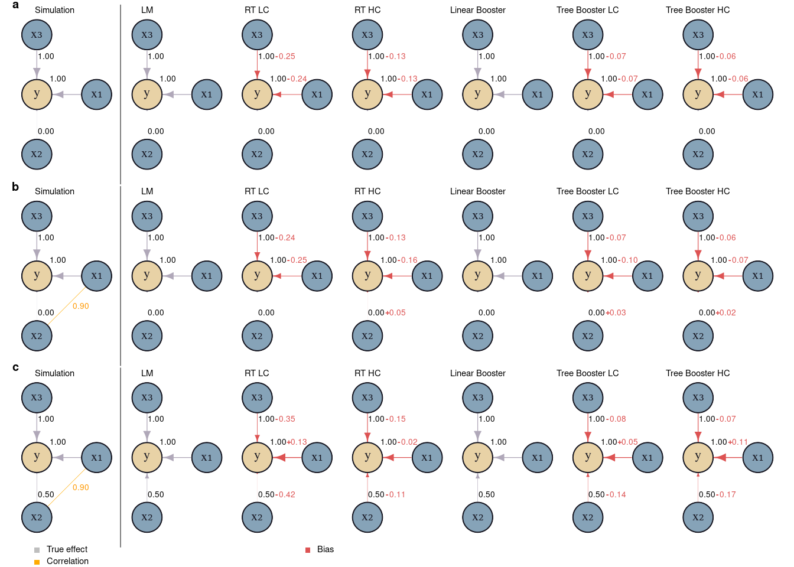
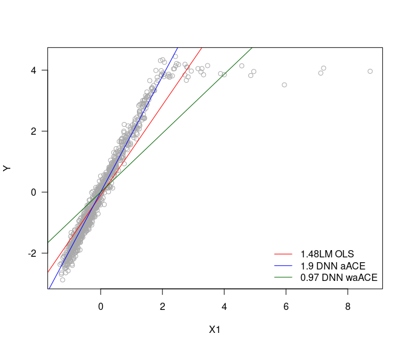
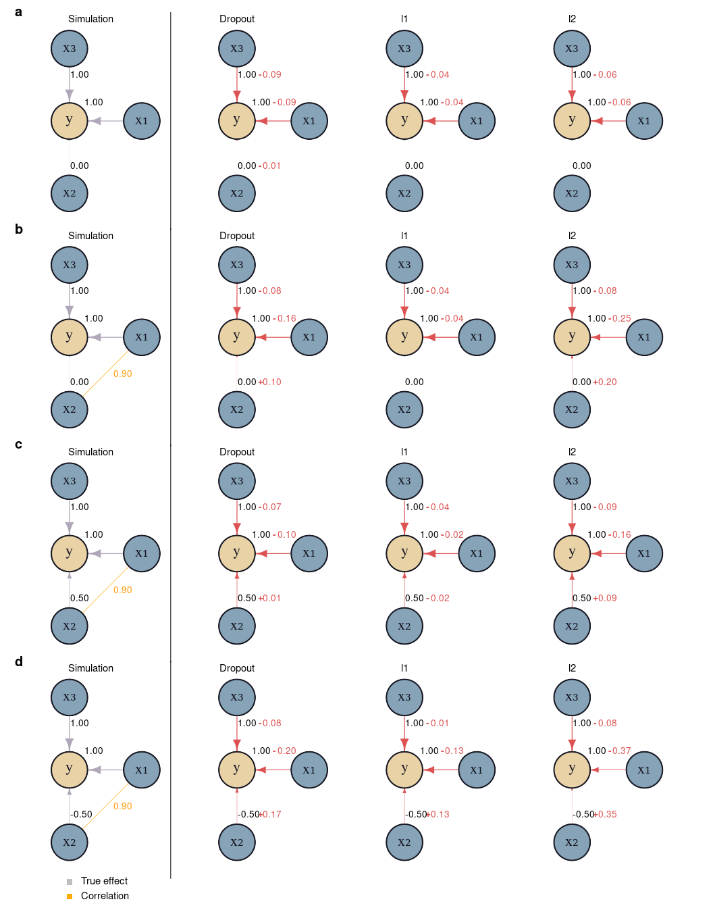
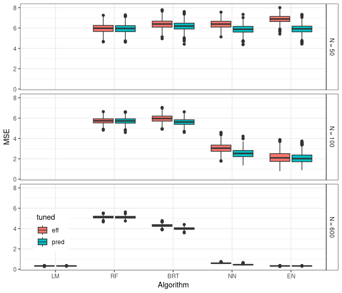

Inductive bias in black-box Machine Learning and Deep Learning models – consequences for the tradeoff between prediction and explanation under feature collinearity
================

This repository contains the code to reproduce the results in Pichler
and Hartig, Inductive bias in black-box Machine Learning and Deep Learning models – consequences for the tradeoff between prediction and explanation under feature collinearity

## Scripts

Scripts to reproduce the analysis can be found in the `code` folder. To
rerun everything, run in the following order:

``` r
source("code/0_Boosting_Regression_Trees.R")
source("code/1_Simulation_proof_of_concept.R")
source("code/2_Simulation_BRT_Pars_Replicated.R")
source("code/2_Simulation_Elastic_net_Pars_Replicated.R")
source("code/2_Simulation_NN_Pars_Replicated.R")
source("code/2_Simulation_RF_Pars_Replicated.R")
source("code/3_aggregate_hyper_parameter_results.R")
source("code/3_Simulation_data_poor.R")
source("code/3_Simulation_data_poor_no_coll.R")
source("code/4_Simulation_proof_of_concept_interactions.R")
source("code/5_NN_learning.R")
source("code/6_Predictions.R")
```

# Results

## Results

### Proof of concept

<figure>

<figcaption aria-hidden="true"><strong>Figure </strong> 1: Bias on
effect estimates for different ML algorithms in three different
simulated causal simulations (a and b). Sample sizes are so large that
stochastic effects can be excluded (1000 observations and 500
repetitions). Effects of the ML models were inferred using average
conditional effects. Row a) shows results for simulations with
uncorrelated predictors with effect sizes (<span
class="math inline"><em>β</em><sub>1</sub></span>=1.0, <span
class="math inline"><em>β</em><sub>2</sub></span>=0.0, and <span
class="math inline"><em>β</em><sub>3</sub></span>=1.0). Row b) shows the
results for simulations with X<sub>1</sub> and X<sub>2</sub> being
strongly correlated (Pearson correlation factor = 0.9) but only
X<sub>1</sub> affects y.</figcaption>
</figure>

### Data-poor simulation

#### Hyper-parameter sensitivity analysis

<figure>

<figcaption aria-hidden="true"><strong>Figure </strong> 2: Results of
hyperparameter tuning for Neural Networks (NN), Boosted Regression Trees
(BRT), Random Forests (RF), and Elastic Net (EN) for 100 observations
with 100 predictors. The influence of the hyperparameters on effect
(<span class="math inline"><em>β̂</em><sub>1</sub></span>) (bias,
variance, and MSE), and the predictions of the model, (<span
class="math inline"><em>ŷ</em></span>), (bias, variance, and MSE) were
estimated by a multivariate generalized additive model (GAM).
Categorical hyperparameters (activation function in NN) were estimated
as fixed effects. The responses (bias, variance, MSE) were centered so
that the categorical hyperparameters correspond to the intercepts. The
variable importance of the hyperparameters was estimated by a random
forest with the MSE of the effect <span
class="math inline"><em>β̂</em><sub>1</sub></span> (first plot) or the
prediction (second plot) as the response. Red dots correspond to the
best predicted set of hyperparameters (based on a random forest), in the
first plot for the minimum MSE of the effect for <span
class="math inline"><em>β̂</em><sub>1</sub></span> and in the second plot
for the minimum MSE of the predictions <span
class="math inline"><em>ŷ</em></span>.</figcaption>
</figure>

#### Bias-variance of predictions and inference

<figure>

<figcaption aria-hidden="true"><strong>Figure </strong> 3: Bias and
variance of estimated effects in data-poor situations. N = 50, 100, and
600 observations of 100 weakly correlated predictors were simulated.
True effects in the data generating model were <span
class="math inline"><em>β</em><sub>1</sub></span>=1.0, <span
class="math inline"><em>β</em><sub>2</sub></span>=0.0, and the other 98
effects were equally spaced between 0 and 1. Models were fitted to the
simulated data (1000 replicates) with the optimal hyperparameters
(except for LM, which doesn’t have hyperparameters). Hyperparameters
were selected based on the minimum MSE of (<span
class="math inline"><em>β̂</em><sub>1</sub></span>) (green) or the
prediction error (based on <span class="math inline"><em>ŷ</em></span> )
(red). Bias and variance were calculated for <span
class="math inline"><em>β̂</em><sub>1</sub></span> and <span
class="math inline"><em>β̂</em><sub>2</sub></span>. Effects <span
class="math inline"><em>β̂</em><sub><em>i</em></sub></span> for <span
class="math inline"><em>i</em> = 1, …, 100</span>) were approximated
using ACE.</figcaption>
</figure>

### Case Study

<figure>

<figcaption aria-hidden="true"><strong>Figure</strong> 4: Difference
between causal and conventional ML models for in-distribution and
out-of-distribution predictions. In a simulated setting, the task is to
predict Crop yield based on Plant growth (data-generating model is shown
in the figure). Climate is an unobservable confounder and has effects on
Plant growth and Pest (growth). In the first scenario,
i.e. in-distribution predictions, Climate did not change, i.e. patients
were exposed to the same climatic conditions; here the difference in
predictive performance for the model with and without Pest growth is
marginal (predictive performance was measured by R<sup>2</sup>). In the
second theoretical setting, the climatic conditions changed (the effects
of Climate on Plant growth and Pest are now zero). Using the previously
trained models, the model without Pest deficit performed significantly
worse than the model with Pest (plot with out-of-distribution
predictions).</figcaption>
</figure>

# Appendix

**Summary:** This document provides supporting information on Pichler &
Hartig – Can machine learning be used for causal inference.

## Extending ACE to two-way interactions

ACE can be extended to $n$-dimensions to detect $n$ way predictor
interactions. Here, we extended ACEs to two dimensions to detect two-way
predictor interactions by asking what the change is of $\hat{f}(\cdot)$
when predictors $x_m$ and $x_k$ change together:

$$\mathbf{ACE}_{mk} = \frac{\partial^2 \hat{f} (\mathbf{X} )}{ \partial x_m \partial x_k }$$

We can approximate $\mathbf{ACE}_{mk}$ with the finite difference
method:

$$
\mathbf{ACE}_{mk} \approx \frac{ \hat{f} (x_1, x_2, ..., x_m + h, x_k + h, ..., x_j ) }{2(h_m + h_k)} -  \frac{ \hat{f} (x_1, x_2, ..., x_m - h, x_k + h, ..., x_j ) }{2(h_m + h_k)} -  \frac{ \hat{f} (x_1, x_2, ..., x_m + h, x_k - h, ..., x_j ) }{2(h_m + h_k)} - \frac{ \hat{f} (x_1, x_2, ..., x_m - h, x_k - h, ..., x_j ) }{2(h_m + h_k)}
$$

$h_m$ and $h_k$ are set to $0.1 \cdot sd(x_m)$ and $0.1 \cdot sd(x_k)$.
All predictors are centered and standardized.

### Proof of concept simulations for inferring interactions

To test the ability of ML algorithms to identify predictor-predictor
interactions, we repeated the proof-of-concept simulations, but with an
interaction between X<sub>1</sub> and X<sub>2</sub>. The data generation
model was
$Y\sim 1.0 \cdot X_1 + 1.0 \cdot X_5 + 1.0 \cdot (X_1 \cdot X_2) + \epsilon$
with \$N(0, 1.0) \$. We simulated two scenarios, in the first
(“collinear”) X<sub>1</sub> and X<sub>2</sub> were collinear (Pearson
correlation factor = 0.9) and in the second without collinearity between
the predictors.

We sampled 1000 and 5000 observations from each scenario. The ML
algorithms (RF, BRT, NN, and NN with dropout) were fit to the data
without predictor engineering the predictor interactions (because ML
algorithms are known to be able to infer interactions automatically),
while the regression algorithms (LM, l1, l2, and elastic-net) received
all combinatorially possible predictor interactions as possible
predictors. All effects were inferred using ACE. The bias was calculated
for the interaction X<sub>1</sub>:X<sub>2</sub>.

<figure>

<figcaption aria-hidden="true"><strong>Figure S</strong> 5: Bias of
proof of concept simulations in inferring two-way interactions between
predictors. First panel shows results for simulations (200 repititions)
for 1000 and 5000 observations with collinear predictors (Pearson
correlation factor = 0.9 between X<sub>1</sub> and X<sub>2</sub>).
Second panel shows results for simulations (200 repititions) for 1000
and 5000 observations with without collinear. Red bars correspond to
1000 observations and blue bars to 5000 observations.</figcaption>
</figure>

We found that for the ML algorithms (RF, BRT, and NN) NN showed the
lowest for all scenarios (Fig. S1). Also collinearity increased the bias
for the ML algorithms. No collinearity or more observations decreased
the bias (Fig. S1). The regression models, LM, LASSO and Ridge
regression, and elastic-net showed the lowest and in case of LM, no
bias. However, we want to note here that the regression models received
all possible predictor-predictor interactions as predictors while the ML
algorithms had to infer the interactions on their own. Whit this in
mind, the performance of the NN is surprising well, even competing with
the penalized regression models. On the other hand, NN with dropout
showed larger biases than BRT (Fig. S1).

### Weighted ACE

If the instances of a predictor x_j are not uniformly distributed, we
propose to calculate a weighted $wACE_k = \Sigma^{N}_{i=1} w_i ACE_{ik}$
with the $w_i$ being, for example, the inverse probabilities of an
estimated density function over the predictor space of $x_k$.

To demonstrate the idea of weighted ACE, we simulated a scenario with
one predictor where the $\beta_1 = 2$ for values of the predictor $< 2$
and for the other predictor values $\beta_1=0$ (Fig. S2). The predictor
was sampled from a log-Normal distribution. We fitted a linear
regression model and a NN on the data and compared the effect estimated
by the LM, the unweighted ACE, and the weighted ACE.

The LM estimated an effect of 1.48, the unweighted ACE was 1.95, and the
weighted ACE was 1.48 (Fig. S2).

<figure>

<figcaption aria-hidden="true"><strong>Figure S</strong> 6: Simulation
example with non-uniform sampled predictor X1 (log normal distributed).
The red line is the effect estimated by a LM OLS. The blue line is the
effect reported by an unweighted ACE from a NN. The green line is the
effect reported by a weighted ACE from a NN.</figcaption>
</figure>

## Boosting and regression trees

### Unbiasedness

Random forest (RF) and boosted regression trees (BRT) showed biased
effect estimates in both scenarios, with and without collinearity,
raising the question of whether the bias is caused by the
boosting/bagging or the regression trees themselves. For RF, we know
that the observed spillover effect is caused by the random subsampling
(mtry parameter) in the algorithm, which explains the bias.

For BRT, however, it is unclear what is causing the bias (boosting or
regression trees) because each member in the ensemble is always
presented with all predictors (at least with the default
hyperparameters, the BRT implementation in xgboost has options to use
bootstrap samples for each tree and also subsamples of columns in each
tree (or node), see Chen and Guestrin (2016)).

To understand how boosting and regression trees affect effect estimates,
we simulated three different scenarios (Fig. S3, first column) without
collinearity (Fig. S3a) and with collinearity (Fig. S3a, b) (we sampled
1000 observations from each data generating model (Fig. S3, first
column) and estimated effects using ACE (500 repititions)).

<figure>

<figcaption aria-hidden="true"><strong>Figure S</strong> 7: Bias on
effect estimates for different ML algorithms (LM = liner regression
model (OLS), RT LC = regression tree with low complexity (depth), RT HC
= regression tree with high complexity, Linear Booster, Tree Booster LC
= tree booster with low complexity, Tree Booster HC = tree boster with
high complexity) in three different simulated causal scenarios (a, b,
and c). Sample sizes are so large that stochastic effects can be
excluded (1000 observations). Effects of the ML models were inferred
using average conditional effects. Row a) shows results for simulations
with uncorrelated predictors with the true effect sizes. Row b) shows
the results for simulations with X<sub>1</sub> and X<sub>2</sub> being
strongly correlated (Pearson correlation factor = 0.9) but only
X<sub>1</sub> has an effect on y (mediator) and row c) shows the results
for X<sub>1</sub> and X<sub>2</sub> being strongly correlated (Pearson
correlation factor = 0.9) with X<sub>1</sub> and X<sub>2</sub> having
effects on Y (confounder scenario).</figcaption>
</figure>

We found that the regression tree (RT) is unable to estimate unbiased
effects (Fig. S3), regardless of the presence or absence of collinearity
or the complexity of the RT (depth of the regression trees). Without
collinearity, effects in regression trees were biased toward zero, less
so with higher complexity (Fig. S3). With collinearity, there was a
small spillover effect for the RT with high complexity (Fig. S3b) to the
collinear zero effect (X<sub>2</sub>), similar to an l2 regularization.
When the collinear predictor (X<sub>2</sub>) had an effect (Fig. S3c),
we found a stronger absolute bias for the smaller of the two collinear
effects (X<sub>2</sub>), confirming our expectation that RTs show a
greedy effect. This greedy behavior was particularly strong for the low
complexity RT (Fig. S3c).

To answer the question of how boosting affects the greediness and
spillover effects of RT, we first investigated the behavior of a linear
booster because of the well-known behavior of OLS under collinearity.
And indeed, we found that the linear booster was unbiased in all three
scenarios (compare LM and linear booster in Fig. S3), showing that
boosting itself can produce unbiased effects.

Now, comparing the vanilla BRTs with low and high complexity (depth of
individual trees) with the linear booster and the RTs, we found similar
biases as for the RTs, in terms of spillover with a collinear zero
effect and the greediness effect in the presence of a weaker collinear
effect (Fig. S3).

### Understanding boosting

Intuitive boosting shouldn’t work because it’s basically a regression of
residuals. That is, and in the case of collinearity, the stronger of two
collinear predictors in the first model would absorb the effect of the
weaker second predictor that, for example, causes the omitted variable
bias (the effect of the missing confounder is absorbed by the collinear
effect).

<figure>

<figcaption aria-hidden="true"><strong>Figure S</strong> 8: Changes of
effects within boosting. (A) shows the total effect of ensemble (linear
booster) until the n-th ensemble member. (B) shows the effects of the
n-th ensemble member. X1 and X2 were correlated (Pearson correlationf
factor = 0.9).</figcaption>
</figure>

Looking at the development of the total effect within a linear booster
model (Fig. S4a), we found that the first members of the ensemble absorb
the effect of the collinear effect ($\beta_1$ absorbed $\beta_2$, Fig.
S4a), but as members are added to the ensemble, the collinear effect
$\beta_2$ slowly recovers the effect of the stronger collinear effect
until both are at their correct effect estimate (Fig. S4a). This
retrieval works by reversing the sign of each member’s effect, so that
$\beta_1$, which initially has an effect of 1.5 (because it absorbed the
effect of $\beta_2$), has small negative effects in subsequent trees,
while $\beta_2$, which is initially estimated at 0, has small positive
effects (Fig. S4b).

## Proof of concept - Additional results

### Addtional scenarios

To better understand the ability of ML algorithms in learning unbiased
effects, we tested additional scenarios (Fig. S5, first column). :::
{.cell}

:::

<figure>

<figcaption aria-hidden="true"><strong>Figure S</strong> 9: Bias on
effect estimates for different ML algorithms in trhee different
simulated causal simulations (a, b, and c). Sample sizes are so large
that stochastic effects can be excluded (1000 observations). Effects of
the ML models were inferred using average conditional effects. Row a)
shows the results for simulations with X<sub>1</sub> and X<sub>2</sub>
being strongly correlated (Pearson correlation factor = 0.99) but only
X<sub>1</sub> has an effect on y. Row b) shows results for simulations
with with predictors (Pearson correlation factor = 0.5) with effect
sizes (X<sub>1</sub>: 1.0, X<sub>2</sub>: 0.5, X<sub>3</sub>: 1.0) and
row c) shows results for simulations with with predictors (Pearson
correlation factor = 0.5) with effect sizes (X<sub>1</sub>: 1.0,
X<sub>2</sub>: -0.5, X<sub>3</sub>: 1.0)</figcaption>
</figure>

We found that NN cannot separate extreme collinear effects as the OLS
(Fig. S5a) which, however, may improve with additional observations.

### Additonal models

To understand the different effects of regularization in NN (dropout),
LASSO regression, and Ridge regression, we tested these models on our
theoretical scenarios (Fig. S6, first column).

<figure>

<figcaption aria-hidden="true"><strong>Figure S</strong> 10: Bias on
effect estimates for different ML algorithms in two different simulated
causal simulations (a and b). Sample sizes are so large that stochastic
effects can be excluded. Effects of the ML models were inferred using
average conditional effects. Row a) shows results for simulations with
with predictors (Pearson correlation factor = 0.5) with effect sizes
(X<sub>1</sub>: 1.0, X<sub>2</sub>: -0.5, X<sub>3</sub>: 1.0). Row b)
shows the results for simulations with X<sub>1</sub> and X<sub>2</sub>
being strongly correlated (Pearson correlation factor = 0.99) but only
X<sub>1</sub> has an effect on y.</figcaption>
</figure>

Dropout has an negative effect on the ability to separate collinear
effects in NN (Fig. S6) while also LASSO and Ridge (as expected) affect
negatively the ability to separate collinear effects (Fig. S6).

## Hyperparameter tuning

We performed a hyperparameter search to check if and how hyperparameters
influence differently or equally effect estimates and the prediction
error, so does a model tune after the prediction error has biased
effects? For that, we created simulation scenarios with 50, 100, 600,
and 2000 observations and 100 predictors with effects
($beta_i, i = 1,...,100$) $\beta_1 = 1.0$, and $\beta_2$ to $\beta_3$
were equally spaced between 0.0 to 1.0 so that $\beta_2 = 0.0$ and
$\beta_{100} = 1.0$.

Predictors were sampled from a multivariate normal distribution and all
predictors were randomly correlated (Variance-covariance matrix $\Sigma$
was sampled from a LKJ-distribution with $\eta = 2.0$.

1,000 combinations of hyper-parameters were randomly drawn (Table S1).
For each draw of hyperparameters, the data simulation and model fitting
was repeated 20 times. Effect sizes of X<sub>1</sub> and X<sub>2</sub>
were recorded (for each hyperparameter combination and for each
reptition). Moreover, bias, variance, and mean square error (MSE) were
recorded for the predictions on a holdout of the same size as the
training data.

<div id="tbl-Hyper">

| Algorithm               | Hyper-parameter       | Range                                             |
|-------------------------|-----------------------|---------------------------------------------------|
| Neural Network          | activation function   | \[relu, leaky_relu, tanh, selu, elu, celu, gelu\] |
|                         | depth                 | \[1, 8\]                                          |
|                         | width                 | \[2, 50\]                                         |
|                         | batch size (sgd)      | \[1, 100\] in percent                             |
|                         | lambda                | \[2.65e-05, 0.16\]                                |
|                         | alpha                 | \[0, 1.0\]                                        |
| Boosted Regression Tree | eta                   | \[0.01, 0.4\]                                     |
|                         | max depth             | \[2, 25\]                                         |
|                         | subsample             | \[0.5, 1\]                                        |
|                         | max tree              | \[30, 125\]                                       |
|                         | lambda                | \[1, 20\]                                         |
| Random Forest           | mtry                  | \[0, 1\] in percent                               |
|                         | min node size         | \[2, 70\]                                         |
|                         | max depth             | \[2, 50\]                                         |
|                         | regularization factor | \[0, 1\]                                          |
| Elastic net             | alpha                 | \[0, 1.0\]                                        |
|                         | lambda                | \[0, 1.0\]                                        |

**Table S** 1: Overview over hyper-parameters for Neural Network,
Boosted Regression Tree, and Random Forest

</div>

### Results hyperparameter tuning

As described in the main text, we analyzed the effects of the
hyperparameters on the different errors using GAMs and variable
importance of random forest (Fig. S7, S8, S9).

<figure>

<figcaption aria-hidden="true"><strong>Figure S</strong> 11: Results of
hyperparameter tuning for Neural Networks (NN), Boosted Regression Trees
(BRT), Random Forests (RF), and Elastic Net (EN) for 50 observations
with 100 predictors. The influence of the hyperparameters on effect
<span class="math inline"><em>β̂</em><sub>1</sub></span> (bias, variance,
and MSE)(true simulated effect <span
class="math inline"><em>β</em><sub>1</sub> = 1.0</span> ) and the
predictions, <span class="math inline"><em>ŷ</em></span> of the model
(bias, variance, and MSE) were estimated by a multivariate generalized
additive model (GAM). Categorical hyperparameters (activation function
in NN) were estimated as fixed effects. The responses (bias, variance,
MSE) were centered so that the categorical hyperparameters correspond to
the intercepts. The variable importance of the hyperparameters was
estimated by a random forest with the MSE of the effect <span
class="math inline"><em>β̂</em><sub>1</sub></span> (first plot) or the
prediction <span class="math inline"><em>ŷ</em></span> (second plot) as
the response. Red dots correspond to the best predicted set of
hyperparameters (based on a random forest), in the first plot for the
minimum MSE of the effect <span
class="math inline"><em>β̂</em><sub>1</sub></span> and in the second plot
for the minimum MSE of the predictions <span
class="math inline"><em>ŷ</em></span>.</figcaption>
</figure>

<figure>

<figcaption aria-hidden="true"><strong>Figure S</strong> 12: Results of
hyperparameter tuning for Neural Networks (NN), Boosted Regression Trees
(BRT), Random Forests (RF), and Elastic Net (EN) for 600 observations
with 100 predictors. The influence of the hyperparameters on effect
<span class="math inline"><em>β̂</em><sub>1</sub></span> (bias, variance,
and MSE)(true simulated effect <span
class="math inline"><em>β</em><sub>1</sub> = 1.0</span> ) and the
predictions, <span class="math inline"><em>ŷ</em></span> of the model
(bias, variance, and MSE) were estimated by a multivariate generalized
additive model (GAM). Categorical hyperparameters (activation function
in NN) were estimated as fixed effects. The responses (bias, variance,
MSE) were centered so that the categorical hyperparameters correspond to
the intercepts. The variable importance of the hyperparameters was
estimated by a random forest with the MSE of the effect <span
class="math inline"><em>β̂</em><sub>1</sub></span> (first plot) or the
prediction <span class="math inline"><em>ŷ</em></span> (second plot) as
the response. Red dots correspond to the best predicted set of
hyperparameters (based on a random forest), in the first plot for the
minimum MSE of the effect <span
class="math inline"><em>β̂</em><sub>1</sub></span> and in the second plot
for the minimum MSE of the predictions <span
class="math inline"><em>ŷ</em></span>.</figcaption>
</figure>

<figure>

<figcaption aria-hidden="true"><strong>Figure S</strong> 13: Results of
hyperparameter tuning for Neural Networks (NN), Boosted Regression Trees
(BRT), Random Forests (RF), and Elastic Net (EN) for 2000 observations
with 100 predictors. The influence of the hyperparameters on effect
<span class="math inline"><em>β̂</em><sub>1</sub></span> (bias, variance,
and MSE)(true simulated effect <span
class="math inline"><em>β</em><sub>1</sub> = 1.0</span> ) and the
predictions, <span class="math inline"><em>ŷ</em></span> of the model
(bias, variance, and MSE) were estimated by a multivariate generalized
additive model (GAM). Categorical hyperparameters (activation function
in NN) were estimated as fixed effects. The responses (bias, variance,
MSE) were centered so that the categorical hyperparameters correspond to
the intercepts. The variable importance of the hyperparameters was
estimated by a random forest with the MSE of the effect <span
class="math inline"><em>β̂</em><sub>1</sub></span> (first plot) or the
prediction <span class="math inline"><em>ŷ</em></span> (second plot) as
the response. Red dots correspond to the best predicted set of
hyperparameters (based on a random forest), in the first plot for the
minimum MSE of the effect <span
class="math inline"><em>β̂</em><sub>1</sub></span> and in the second plot
for the minimum MSE of the predictions <span
class="math inline"><em>ŷ</em></span>.</figcaption>
</figure>

### Optimal hyperparameters

The hyperparameters were chosen based on the lowest MSE for the
predictive performance of the models (Table S2) and the lowest MSE for
the effect ($\beta_1$) on X<sub>1</sub> (Table S3). The selection of the
best hyperparameters was done by first fitting a random forest (default
parameters) with the MSE as response and the hyperparameters as
predictors, and then using the set of hyperparameters that predicted the
lowest MSE.

<div id="tbl-Hyper_selected_pred">

| Algorithm | Hyperparameter        | n = 50 | n = 100 | n = 600 | n = 2000 |
|-----------|-----------------------|--------|---------|---------|----------|
| NN        | activations           | celu   | selu    | selu    | selu     |
|           | sgd                   | 0.944  | 0.348   | 0.098   | 0.098    |
|           | depth                 | 1      | 1       | 1       | 1        |
|           | width                 | 24     | 20      | 35      | 35       |
|           | alpha                 | 0.939  | 0.821   | 0.693   | 0.693    |
|           | lambda                | 0.003  | 0.02    | 0.019   | 0.019    |
| BRT       | eta                   | 0.072  | 0.126   | 0.245   | 0.147    |
|           | max_depth             | 2      | 2       | 2       | 4        |
|           | subsample             | 0.666  | 0.511   | 0.77    | 0.57     |
|           | lambda                | 9.073  | 8.888   | 8.21    | 4.556    |
|           | max_tree              | 117    | 109     | 110     | 114      |
| RF        | mtry                  | 0.129  | 0.466   | 0.792   | 0.603    |
|           | min.node.size         | 12     | 2       | 3       | 6        |
|           | max.depth             | 21     | 19      | 47      | 30       |
|           | regularization.factor | 0.914  | 0.874   | 0.736   | 0.615    |
| EN        | alpha                 | 0.007  | 0.008   | 0.025   | 0.025    |
|           | lambda                | 0.286  | 0.028   | 0.006   | 0.006    |

**Table S** 2: Best predicted set of hyperparameterfor ML algorithms
(tuned after MSE of predictions)

</div>

<div id="tbl-Hyper_selected_eff">

| Algorithm | Hyperparameter        | n = 50 | n = 100 | n = 600 | n = 2000 |
|-----------|-----------------------|--------|---------|---------|----------|
| NN        | activations           | selu   | selu    | selu    | selu     |
|           | sgd                   | 0.391  | 0.395   | 0.112   | 0.175    |
|           | depth                 | 3      | 3       | 2       | 2        |
|           | width                 | 18     | 40      | 19      | 39       |
|           | alpha                 | 0.135  | 0.613   | 0.332   | 0.498    |
|           | lambda                | 0.009  | 0.011   | 0.002   | 0.006    |
| BRT       | eta                   | 0.252  | 0.327   | 0.393   | 0.393    |
|           | max_depth             | 11     | 17      | 3       | 3        |
|           | subsample             | 0.514  | 0.584   | 0.523   | 0.523    |
|           | lambda                | 9.051  | 7.779   | 9.053   | 9.053    |
|           | max_tree              | 71     | 102     | 124     | 124      |
| RF        | mtry                  | 0.137  | 0.926   | 0.462   | 0.952    |
|           | min.node.size         | 2      | 4       | 9       | 12       |
|           | max.depth             | 31     | 29      | 29      | 36       |
|           | regularization.factor | 0.683  | 0.894   | 0.587   | 0.566    |
| EN        | alpha                 | 0.011  | 0       | 0.011   | 0.011    |
|           | lambda                | 0.016  | 0.018   | 0.009   | 0.009    |

**Table S** 3: Best predicted set of hyperparameterfor ML algorithms
(tuned after MSE of effect X<sub>1</sub>)

</div>

## Additional results for data-poor scenarios

### Prediction error of scenarios

Fig. S10 shows the MSE of the predictions on the holdouts for the
different ML algorithms and different number of observations of the
data-poor scenarios (see main text).

<figure>

<figcaption aria-hidden="true"><strong>Figure S</strong> 14: Prediction
error (mean square error, MSE) of data poor simulations with optimal
hyperparameters either tuned after the best MSE of the effect size (red)
or the best MSE of the prediction error (blue).</figcaption>
</figure>

## Data-poor scenarios without collinearity

### Bias and variance of effects

To assess the effect of collinearity on the data-poor simulations, we
repeated the scenarios but without collinearity. $\Sigma$ which was used
in the sampling process of the predictor matrix (multivariate normal
distribution) was set to the identity matrix. While it is not ideal, we
used the best hyperparameters (Table S3, Table S4) which were tuned for
the collinear scenarios, for these scenarios

<figure>

<figcaption aria-hidden="true"><strong>Figure S</strong> 15: Bias and
variance of estimated effects in data-poor situations. N = 50, 100, and
600 observations of 100 uncorrelated predictors were simulated. True
effects in the data generating model were <span
class="math inline"><em>β</em><sub>1</sub></span>=1.0, <span
class="math inline"><em>β</em><sub>2</sub></span>=0.0, and the other 98
effects were equally spaced between 0 and 1. Models were fitted to the
simulated data (1000 replicates) with the optimal hyperparameters
(except for LM, which doesn’t have hyperparameters). Hyperparameters
were selected based on the minimum MSE of (<span
class="math inline"><em>β̂</em><sub>1</sub></span>) (green) or the
prediction error (based on <span class="math inline"><em>ŷ</em></span> )
(red). Bias and variance were calculated for <span
class="math inline"><em>β̂</em><sub>1</sub></span> and <span
class="math inline"><em>β̂</em><sub>2</sub></span>. Effects <span
class="math inline"><em>β̂</em><sub><em>i</em></sub></span> for <span
class="math inline"><em>i</em> = 1, …, 100</span>) were approximated
using ACE.</figcaption>
</figure>

We found similar results as for data-poor scenarios with collinearity
(Fig. S11). NN and elastic-net show the lowest errors and strongest
increase in those errors with increasing number of observations (Fig.
S11).

### Prediction error of scenarios

Fig. S12 shows the prediction errors for the ML algorithms for the
data-poor simulations without collinearity. We found similar results as
for the data-poor simulations with collinearity.

<figure>

<figcaption aria-hidden="true"><strong>Figure S</strong> 16: Prediction
error (mean square error, MSE) of data poor simulations with optimal
hyperparameters either tuned after the best MSE of the effect size (red)
or the best MSE of the prediction error (blue).</figcaption>
</figure>

## Learning in neural networks

To understand the internal learning of neural networks, we trained
neural networks of two different sizes (3 layers of 50 units and 3
layers of 500 units) on a simple collinear scenario
($Y \sim 1. 0\cdot X_1 + 0.0\cdot X_2+ \epsilon, \epsilon \sim N(0, 0.3)$;
X<sub>1</sub> and X<sub>2</sub> were collinear (Pearson correlation
factor = 0.9)) and calculated the ACE after each batch optimization
step.

We found that the estimates of the botch effect were initially estimated
to be around 0 (Fig. S13 A, B), probably due to the initialization of
the neural networks, which resembles a shrinkage behavior (weights have
to be moved away from 0 step by step in the gradient descent). After
this initialization phase, both estimates are within the expected
negative log-likelihood surface of OLS (Fig. S13C) and are estimated
over the training period to the correct estimates (X<sub>1</sub> = 1.0
and X<sub>2</sub> = 0.0).

<figure>

<figcaption aria-hidden="true"><strong>Figure S</strong> 17: Learning
neural networks. Neural networks were trained on simulated data (1000
observations) with 5 predictors, X<sub>1</sub> has a linear effect on Y,
and X<sub>2</sub> is collinear with X<sub>1</sub> (Pearson correlation
factor = 0.9). The ACE was computed after each optimization step (i.e.,
after each batch in stochastic gradient descent) (20 repetitions).
Panels A and B show the evolution of the effects for X<sub>1</sub> and
X<sub>2</sub> (true effects: X<sub>1</sub> = 1.0 and X<sub>2</sub> =
0.0). Panel A shows the results for a neural network with 50 units in
each of the 3 hidden layers, while Panel B shows the results for a
neural network with 500 units in each of the 3 hidden layers. Panel C
shows the negative log likelihood surface for the corresponding
OLS.</figcaption>
</figure>

## References

## Session info

    R version 4.2.3 (2023-03-15)
    Platform: x86_64-pc-linux-gnu (64-bit)
    Running under: Ubuntu 20.04.6 LTS

    Matrix products: default
    BLAS:   /usr/lib/x86_64-linux-gnu/openblas-pthread/libblas.so.3
    LAPACK: /usr/lib/x86_64-linux-gnu/openblas-pthread/liblapack.so.3

    locale:
     [1] LC_CTYPE=en_US.UTF-8       LC_NUMERIC=C              
     [3] LC_TIME=en_US.UTF-8        LC_COLLATE=en_US.UTF-8    
     [5] LC_MONETARY=en_US.UTF-8    LC_MESSAGES=en_US.UTF-8   
     [7] LC_PAPER=en_US.UTF-8       LC_NAME=C                 
     [9] LC_ADDRESS=C               LC_TELEPHONE=C            
    [11] LC_MEASUREMENT=en_US.UTF-8 LC_IDENTIFICATION=C       

    attached base packages:
    [1] stats     graphics  grDevices utils     datasets  methods   base     

    other attached packages:
     [1] latex2exp_0.9.6   MASS_7.3-58.3     glmnetUtils_1.1.8 glmnet_4.1-7     
     [5] Matrix_1.5-3      cito_1.0.1        torch_0.10.0      ggeffects_1.2.0  
     [9] broom_1.0.4       kableExtra_1.3.4  knitr_1.42        flextable_0.9.0  
    [13] glmmTMB_1.1.6     gridExtra_2.3     viridis_0.6.2     viridisLite_0.4.1
    [17] hrbrthemes_0.8.0  mgcViz_0.1.9      qgam_1.3.4        mgcv_1.8-42      
    [21] nlme_3.1-162      ranger_0.14.1     xgboost_1.7.3.1   Cairo_1.6-0      
    [25] igraph_1.2.11     lubridate_1.9.2   forcats_1.0.0     stringr_1.5.0    
    [29] dplyr_1.1.1       purrr_1.0.1       readr_2.1.4       tidyr_1.3.0      
    [33] tibble_3.2.1      tidyverse_2.0.0   ggplot2_3.4.1    

    loaded via a namespace (and not attached):
      [1] uuid_1.1-0              backports_1.4.1         systemfonts_1.0.4      
      [4] plyr_1.8.8              TMB_1.9.3               splines_4.2.3          
      [7] digest_0.6.31           foreach_1.5.2           htmltools_0.5.5        
     [10] fansi_1.0.4             magrittr_2.0.3          checkmate_2.1.0        
     [13] doParallel_1.0.17       tzdb_0.3.0              extrafont_0.19         
     [16] matrixStats_0.63.0      officer_0.6.2           extrafontdb_1.0        
     [19] svglite_2.1.1           askpass_1.1             timechange_0.2.0       
     [22] gfonts_0.2.0            colorspace_2.1-0        rvest_1.0.3            
     [25] textshaping_0.3.6       xfun_0.38               callr_3.7.3            
     [28] crayon_1.5.2            jsonlite_1.8.4          lme4_1.1-32            
     [31] survival_3.5-5          iterators_1.0.14        glue_1.6.2             
     [34] gtable_0.3.3            webshot_0.5.4           Rttf2pt1_1.3.12        
     [37] shape_1.4.6             abind_1.4-5             scales_1.2.1           
     [40] fontquiver_0.2.1        GGally_2.1.2            miniUI_0.1.1.1         
     [43] Rcpp_1.0.10             isoband_0.2.7           xtable_1.8-4           
     [46] bit_4.0.5               fontLiberation_0.1.0    httr_1.4.5             
     [49] RColorBrewer_1.1-3      ellipsis_0.3.2          pkgconfig_2.0.3        
     [52] reshape_0.8.9           farver_2.1.1            utf8_1.2.3             
     [55] crul_1.3                tidyselect_1.2.0        labeling_0.4.2         
     [58] rlang_1.1.0             later_1.3.0             munsell_0.5.0          
     [61] tools_4.2.3             cli_3.6.1               generics_0.1.3         
     [64] evaluate_0.20           fastmap_1.1.1           yaml_2.3.7             
     [67] ragg_1.2.5              processx_3.8.0          bit64_4.0.5            
     [70] zip_2.2.2               mime_0.12               coro_1.0.3             
     [73] xml2_1.3.3              compiler_4.2.3          rstudioapi_0.14        
     [76] curl_5.0.0              gamm4_0.2-6             stringi_1.7.12         
     [79] ps_1.7.3                gdtools_0.3.3           lattice_0.20-45        
     [82] fontBitstreamVera_0.1.1 nloptr_2.0.3            vctrs_0.6.1            
     [85] pillar_1.9.0            lifecycle_1.0.3         data.table_1.14.8      
     [88] httpuv_1.6.9            R6_2.5.1                promises_1.2.0.1       
     [91] KernSmooth_2.23-20      codetools_0.2-19        boot_1.3-28.1          
     [94] openssl_2.0.6           withr_2.5.0             httpcode_0.3.0         
     [97] parallel_4.2.3          hms_1.1.3               grid_4.2.3             
    [100] minqa_1.2.5             rmarkdown_2.21          numDeriv_2016.8-1.1    
    [103] shiny_1.7.4            

<div id="refs" class="references csl-bib-body hanging-indent">

<div id="ref-chen2016xgboost" class="csl-entry">

Chen, Tianqi, and Carlos Guestrin. 2016. “Xgboost: A Scalable Tree
Boosting System.” In *Proceedings of the 22nd Acm Sigkdd International
Conference on Knowledge Discovery and Data Mining*, 785–94.

</div>

</div>
