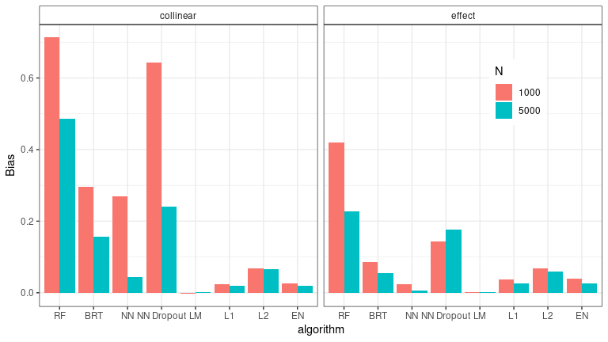

Supporting information Appendix for Pichler & Hartig – Can machine
learning be used for causal inference?
================

# Can machine learning be used for causal inference?

This repository contains the code to reproduce the results in Pichler
and Hartig, Can machine learning be used for causal inference?

# Results

## Results

### Proof of concept

``` r
parser = function(true, bias, pos = 1) {
  if(pos == 1) { 
    yp = 1.25
    xp = 0.15
  }
  if(pos == 3) {
    yp = 1.63
    xp = -0.05
  }
  if(pos == 2) {
    yp = 0.37
    xp = -0.05
  }
  
  bb = round(bias, 2)
  if(bb > 0) { 
    symb = "+" 
    if(abs(bb) > 0.001) text(x = xp + 0.280, y = yp+0.01, pos = 4, symb, cex = 1.3, col = "#e60000", font = 2)
  } else { 
    symb = "-"
      if(abs(bb) > 0.001) text(x = xp + 0.29, y = yp, pos = 4, symb, cex = 1.3, col = "#e60000", font = 2)
    }
  bb = abs(bb)
   text(x = xp, y = yp, pos = 4,label = format(true, nsmall = 2), cex = 1.3)

  if(bb> 0.001) text(x = xp+ 0.35, y = yp, pos = 4, label = format(bb, nsmall = 2), cex = 1.3, col = "#e60000", font = 1)
}


sc = c("effects", "collinearity_0.90")

cairo_pdf("plots/Fig_2.pdf", width = 12, height = 7)

par(mfcol = c(2,6), mar = c(5,0.5, 2, 1.4), oma = c(1, 2, 2, 1))
labs =  c("LM","RF",  "BRT", "NN","Dropout", "l1", "l2", "Elastic-net")
cex_fac = 1.3
minArrow = function(x) sapply(x, function(xx) max(c(0.1, xx)))

true_effs = matrix(c(
  1, 0.0, 1,
  1, 0.0, 1
), 2, 3, byrow = TRUE)

vertex_col_p = "#86A3B8"
vertex_col_y = "#E8D2A6"
vertex_col_frame = "#181823"
vertex_frame_width = 2.0

# A simulation

g1 = graph(c("x\U2081", "y", "x\U2082", "y", "x\U2083", "y"),  
            directed=TRUE ) 
layout_as_tree(g1, root = "y", circular = TRUE, flip.y = TRUE)
```

                  [,1]      [,2]
    [1,]  1.000000e+00 0.7071068
    [2,]  0.000000e+00 0.7071068
    [3,] -7.071068e-01 0.0000000
    [4,] -1.836970e-16 1.7071068

``` r
eqarrowPlot(g1, matrix(c(1,1,
                         0,1,
                         0,0,
                         0,2), nrow = 4L, 2L, byrow = TRUE) ,
            cols = c(addA(rep(vertex_col_p, 1), 1.0), 
                     vertex_col_y, 
                     addA(rep(vertex_col_p, 1), 1.0),
                     addA(rep(vertex_col_p, 1), 1.0)),
            edge.arrow.size=minArrow(c(1.00, 0.1, 1.0)),
            edge.width=c(1.00, 0.1, 1.0)*cex_fac,
            edge.label = rep("",3),
            edge.label.cex = 1.6,
            vertex.frame.color=vertex_col_frame,
            vertex.label.color= vertex_col_frame,
            vertex.frame.width = vertex_frame_width,
            edge.colors = rep("#B0A8B9", 3))
  text(letters[1], cex = 1.9, x = -1.6, y = 1.5, xpd = NA, font = 2)
  text("Simulation", x = 0.3, y = 2.3, xpd = NA, cex = 1.4, pos = 3)
parser(1.00, 0.0000, pos = 1)
parser(0.0, 0.0000, pos = 2)
parser(1.00, 0.0000, pos = 3)  
segments(x0 = 1.4, x1 = 1.4, y0 = -0.5, y1 = 2.5, xpd = NA)


# B simulation
g1 <- graph(c("x\U2081", "y", "x\U2082","y", "x\U2083", "y", "x\U2081", "x\U2082"),  
            directed=TRUE ) 
eqarrowPlot(g1, matrix(c(1,1,
                       0,1,
                       0,0,
                       0,2), nrow = 4L, 2L, byrow = TRUE) , 
            cols = c(addA(rep(vertex_col_p, 1), 1.0), vertex_col_y, addA(rep(vertex_col_p, 1), 1.0), addA(rep(vertex_col_p, 2), 1.0)),
            edge.arrow.size=minArrow(c(1.00, 0.1, 1.0, 0.9)),#abs(edges[c(1, 2, 5)]), 
            edge.width=c(1.00, 0.1, 1.0, 0.5)*cex_fac,#abs(edges[c(1, 2, 5)])*cex_fac,
            edge.label = rep("", 3), 
            edge.label.cex = 1.4, 
            edge.arrow.mode = c(rep(">", 3), "-"), 
            vertex.frame.width = vertex_frame_width,
            vertex.frame.color=vertex_col_frame,
            vertex.label.color= vertex_col_frame,
            edge.colors = c(rep("#B0A8B9", 1),"#B0A8B9","#B0A8B9", "#ffab02"))
text(letters[2], cex = 1.9, x = -1.6, y = 1.5, xpd = NA, font = 2)
text("Simulation", x = 0.3, y = 2.3, xpd = NA, cex = 1.4, pos = 3)
parser(1.00, 0.0000, pos = 1)
parser(0.0, 0.0000, pos = 2)
parser(1.00, 0.0000, pos = 3)  
text("0.90", cex = 1.3, x = 0.74, y = 0.5, xpd = NA, font = 1, col = "#ff9902")
segments(x0 = 1.4, x1 = 1.4, y0 = -0.5, y1 = 2.5, xpd = NA)
points(x = 0, y = -0.55, col = "grey", xpd = NA, pch = 15, cex = 1.8)
text(x = 0.1, y = -0.55, label = "True effect", xpd = NA, pos = 4, cex = 1.4)
points(x = 0, y = -0.75, col = "#ffab02", xpd = NA, pch = 15, cex = 1.8)
text(x = 0.1, y = -0.75, label = "Correlation", xpd = NA, pos = 4, cex = 1.4)
for(i in c(1, 2, 3, 4, 8)) {
  counter = 1
  for(j in c(1, 2)) {

    tmp = Results[[sc[j]]]
    sd = Results_sd[[sc[j]]][i,]
    edges = round(tmp[i,], 5)
    bias = edges[c(1, 2, 5)] - true_effs[j,]
    g1 = graph(c("x\U2081", "y", "x\U2082", "y", "x\U2083", "y"),  
                directed=TRUE ) 
    layout_as_tree(g1, root = "y", circular = TRUE, flip.y = TRUE)
    eqarrowPlot(g1, matrix(c(1,1,
                             0,1,
                             0,0,
                             0,2), nrow = 4L, 2L, byrow = TRUE) ,
                cols = c(addA(rep(vertex_col_p, 1), 1.0), vertex_col_y, addA(rep(vertex_col_p, 1), 1.0), addA(rep(vertex_col_p, 1), 1.0)),
                edge.arrow.size=minArrow(abs(-true_effs[j,] - bias)),#abs(edges[c(1, 2, 5)]), 
                edge.width=abs(-true_effs[j,] - bias)*cex_fac,#abs(edges[c(1, 2, 5)])*cex_fac,
                edge.label = rep("",3),
                vertex.frame.width = vertex_frame_width,
                vertex.frame.color=vertex_col_frame,
                vertex.label.color= vertex_col_frame,
                edge.label.cex = 1.4,
                edge.colors = ifelse(abs(bias) < 0.01, "#B0A8B9", "#DD5353"))
    parser(true_effs[j, 1], bias[1], pos = 1)
    parser(true_effs[j, 2], bias[2], pos = 2)
    parser(true_effs[j, 3], bias[3], pos = 3)
    text(labs[i], x = 0, y = 2.3, xpd = NA, cex = 1.4, pos = 3)
    if(i == 1) {
      text(letters[counter], cex = 1.9, x = -2.2, y = 2.5, xpd = NA, font = 2)
      counter = counter + 1
    }

  }
  if(i == 3) {
    points(x = 0-1, y = -1.1*0.5, col = "#DD5353", xpd = NA, pch = 15, cex = 1.8)
    text(x = 0.1-1, y = -1.1*0.5, label = "Bias", xpd = NA, pos = 4, cex = 1.4)
  }
}

dev.off()
```

    png 
      2 

### Data-poor simulation

``` r
cairo_pdf("plots/Fig_3.pdf", width = 10, height = 7)

bias = res_pred[[1]]$bias[1, 1]
var = res_pred[[1]]$var[1, 1]
draw_stacked_bar = function(bias, var, xleft = 0.0, w = 0.15) {
  rect(xleft, 0, xleft+w, abs(bias), col = "#96c6ed" )
  rect(xleft, abs(bias), xleft+w, abs(bias)+var, col = "#e0acd5" )
}
methods2 = c("LM", "RF", "BRT", "NN", "Elastic-net")
methods2[-1] = paste0(methods2[-1], " tuned")
par(mfrow = c(3, 5), mar = c(1, 1, 1, 1)*0.5, oma = c(12, 4, 4, 4))
y_labels = c("N = 50", "N = 100", "N = 600")
for(j in 1:3) {
  for(i in 1:5) {
    plot(NULL, NULL, xlim = c(0, 1), ylim = c(0, 1), yaxt = "n", xaxt = "n", xaxs = "i", yaxs = "i", xlab = "", ylab = "")
    if( i > 1) {
      rect(0.5, 0, 1.0, 1.0, col = "#EDBD9660", border = NA)
      rect(0.0, 0, 0.5, 1.0, col = "#9BED9660", border = NA)

      draw_stacked_bar(xleft = 0.1, res_pred[[j]]$bias[i, 1], res_pred[[j]]$var[i, 1])
      draw_stacked_bar(xleft = 0.1+0.18, res_pred[[j]]$bias[i, 2], res_pred[[j]]$var[i, 2])
      draw_stacked_bar(xleft = 0.1+0.47, res_eff[[j]]$bias[i, 1], res_eff[[j]]$var[i, 1])
      draw_stacked_bar(xleft = 0.1+0.18+0.47, res_eff[[j]]$bias[i, 2], res_eff[[j]]$var[i, 2])
    } else {
      
      if( ((j %in% c(1, 2)) && (i == 1) )) {
        text(x = 0.5, y = 0.5, pos = 3, label = "NA", font = 2)
      } else {
        draw_stacked_bar(xleft = 0.325, res_pred[[j]]$bias[i, 1], res_pred[[j]]$var[i, 1])
        draw_stacked_bar(xleft = 0.325+0.18, res_pred[[j]]$bias[i, 2], res_pred[[j]]$var[i, 2])

        text(x = c(0.185, 0.185+0.18),y = -0.24, 
        labels = c("Bias+Variance \U03B2\U2081", "Bias+Variance \U03B2\U2082"), 
        srt = 45,
        xpd = NA, pos = 1)        
      }
      
    }
    if(j == 1) {
      rect(0, 1.0, 1.0, 1.15, xpd = NA, border = "black")
      text(0.5, y = 0.98, pos = 3, xpd = NA, label = methods2[i], cex = 1.3, font = 2)
    }
    if(i == 5) {
      rect(1, 0, 1.15, 1.0, xpd = NA, border = "black")
      text(y = 0.72, x = 1.01, pos = 4, xpd = NA, label = y_labels[j], cex = 1.3, font = 2, srt = -90)
    }
    if( (j == 3) && (i > 1) ){
      text(x = c(0.185, 0.185+0.18, c(0.185, 0.185+0.18)+0.47)-0.22,y = -0.24, 
           labels = c("Bias+Variance \U03B2\U2081", "Bias+Variance \U03B2\U2082", "Bias+Variance \U03B2\U2081", "Bias+Variance \U03B2\U2082"), 
           srt = 45,
           xpd = NA, pos = 1)
    }    
  }
}

points(pch = 15, x = rep(-1.0, 2), y = c(-0.7, -0.8), xpd = NA, col = c("#96c6ed","#e0acd5"), cex = 1.5)
text(x = rep(-1.0, 2)+0.01, y = c(-0.7, -0.8)-0.02, pos = 4, labels = c("Bias", "Variance"), xpd = NA)

points(pch = 15, x = rep(-0.2, 2), y = c(-0.7, -0.8), xpd = NA, col = c("#9BED96","#EDBD96"), cex = 1.5)
text(x = rep(-0.2, 2)+0.01, y = c(-0.7, -0.8)-0.02, pos = 4, labels = c("Tuned after MSE of predictions", "Tuned after MSE of \U03B2\U2081"), xpd = NA)

dev.off()      
```

    png 
      2 

#### Hyper-parameter sensitivity analysis

``` r
library(xgboost)
library(ranger)
library(qgam)
library(mgcv)
library(mgcViz)
library(ggplot2)
library(tidyverse)
results = readRDS("results/hyper_parameter_aggregation_100.RDS")
data = do.call(rbind, lapply(results, function(r) r$data))
```

``` r
# results = readRDS("results/hyper_parameter_aggregation_100.RDS")
# data = do.call(rbind, lapply(results, function(r) r$data))

labels = c("CELU",
           "ELU",
           "GELU",
           "Leaky ReLU",
           "ReLU",
           "SELU",
           "tanh",
           "batch size",
           "depth",
           "width",
           "alpha",
           "lambda",
           "eta",
           "max depth",
           "subsample",
           "max tree",
           "mtry",
           "min node size",
           "max depth",
           "regularization factor")
names(labels) = c("activationscelu",
                  "activationselu",
                  "activationsgelu",
                  "activationsleaky_relu",
                  "activationsrelu",
                  "activationsselu",
                  "activationstanh",
                  "sgd",
                  "depth", 
                  "width",
                  "alpha", 
                  "lambda",
                  "eta",
                  "max_depth",
                  "subsample",
                  "max_tree",
                  "mtry",
                  "min.node.size",
                  "max.depth",
                  "regularization.factor")

cairo_pdf("plots/Fig_4.pdf", width = 9, height = 10)
tck = 0.015
mgp = 0.07 
eff_range = list(eff_range2 = c(-0.5, 0.5),eff_range1 = c(-0.04, 0.04))
vi_range = list(c(0, 0.04), c(0, 2.5))
cols = (c("#1C1C1BFF","#CC4A7EFF"))
plot_tuning(data = data, results = results, eff_range = eff_range, vi_range = vi_range, line_col = cols)
axis(3, at = scales::rescale(c(-0.25, 0.0, 0.25), to = c(0.02, 0.28), from = eff_range[[1]]), labels = c(-0.25, 0.0, 0.25), tck = tck, mgp = c(3, mgp, 0))
axis(3, at = scales::rescale(c(-0.02, 0.0, 0.02), to = c(0.02, 0.28), from = eff_range[[2]])+0.5, labels = c(-0.02, 0.0, 0.02), tck = tck, mgp = c(3, mgp, 0))

axis(3, at = scales::rescale(c(0, log10(0.03+1), log10(0.08+1)), to = c(0.3, 0.5), from = vi_range[[1]]),  
     labels = c(0, 0.03, 0.08), tck = tck, mgp = c(3, mgp, 0))
axis(3, at = scales::rescale(c(0, log10(10+1), log10(130+1)), to = c(0.3, 0.5), from = vi_range[[2]])+0.5, labels = c(0, 10, 130), tck = tck, mgp = c(3, mgp, 0))
dev.off()
```

    png 
      2 

``` r
hyper_to_text = function(x, pre="", NN = FALSE) {x
  x = unlist(x)
  if(NN) x[[1]] = paste0("'", x[[1]], "'")
  return(paste0(paste0(paste0(pre, names(x)), "=", x, collapse = "\n"), "\n") )
}

settings = matrix(c(50, 100, 100, 100, 600, 100), ncol = 2, byrow = TRUE)

sapply(1:3, function(k) {
  tmp = as.integer(settings[k,])
  paths <<- c(
    paste0("results/NN_pars_",tmp[1],"_",tmp[2],"_replicate.RDS"),
    paste0("results/BRT_pars_",tmp[1],"_",tmp[2],"_replicate.RDS"),
    paste0("results/RF_pars_",tmp[1],"_",tmp[2],"_replicate.RDS"),
    paste0("results/Elastic_net_pars_",tmp[1],"_",tmp[2],"_replicate.RDS")
  )
  methods = c("NN", "BRT", "RF", "Elastic_net")
  results = lapply(1:4, function(i) {
    tmp = get_coefficients(i, gam = FALSE, path = paths[i], method = methods[i])$hyper$eff %>% select(-var_effect, -bias_zero, -var_zero, -bias_pred, -var_pred, -mse_eff, -mse_zero, -bias_effect, -mse_pred)
    names(tmp) = paste0(c("NN", "BRT", "RF", "EN")[i], "_", names(tmp))
    return(tmp)
    })
  conn = file(paste0("code/hyper-parameter/BIAS_hyper_param_config_",tmp[1],"_",tmp[2],".R"))
  writeLines(
    paste0(
      paste0("## Hyper-parameters for data-poor scenarios created by 'results.qmd' file\n"),
      hyper_to_text(results[[1]], NN = TRUE),
      hyper_to_text(results[[2]], NN = FALSE),
      hyper_to_text(results[[3]], NN = FALSE),
      hyper_to_text(results[[4]], NN = FALSE)), 
    conn )
  close(conn)
})
```

    [1] 0 0 0

``` r
sapply(1:3, function(k) {
  tmp = as.integer(settings[k,])
  paths <<- c(
    paste0("results/NN_pars_",tmp[1],"_",tmp[2],"_replicate.RDS"),
    paste0("results/BRT_pars_",tmp[1],"_",tmp[2],"_replicate.RDS"),
    paste0("results/RF_pars_",tmp[1],"_",tmp[2],"_replicate.RDS"),
    paste0("results/Elastic_net_pars_",tmp[1],"_",tmp[2],"_replicate.RDS")
  )
  methods = c("NN", "BRT", "RF", "Elastic_net")
  results = lapply(1:4, function(i) {
    tmp = get_coefficients(i, gam=FALSE, path = paths[i], method = methods[i])$hyper$pred %>% select(-var_effect, -bias_zero, -var_zero, -bias_pred, -var_pred, -mse_eff, -mse_zero, -bias_effect, -mse_pred)
    names(tmp) = paste0(c("NN", "BRT", "RF", "EN")[i], "_", names(tmp))
    return(tmp)
    })
  conn = file(paste0("code/hyper-parameter/MSE_hyper_param_config_",tmp[1],"_",tmp[2],".R"))
  writeLines(
    paste0(
      paste0("## Hyper-parameters for data-poor scenarios created by 'create_hyper_config_.R' file\n"),
      hyper_to_text(results[[1]], NN = TRUE),
      hyper_to_text(results[[2]], NN = FALSE),
      hyper_to_text(results[[3]], NN = FALSE),
      hyper_to_text(results[[4]], NN = FALSE)), 
    conn )
  close(conn)
})
```

    [1] 0 0 0

### Case Study

``` r
methods = c("LM", "BRT", "RF","EN", "NN" )


results = readRDS("results/results_case_study.RDS")
results = apply(results, 2:3, mean)

rownames(results) = methods
colnames(results) = c("Conv_out", "Conv_in", "Causal_out", "Causal_in" )
results = data.frame(results, method = methods)
results = 
  results %>% 
    pivot_longer(c(Conv_out, Conv_in, Causal_out, Causal_in), names_to = "scenario", values_to = "R2") %>% 
    mutate(model = ifelse(stringr::str_detect(scenario, "Causal"), "Causal model", "Conventional model"),
           prediction = ifelse(stringr::str_detect(scenario, "out"), "out", "in")
           ) %>% 
    dplyr::select(-scenario)


results$method = as.factor(results$method)
results$method = forcats::lvls_reorder(results$method, c(3,5,1, 4, 2) )
results$model = as.factor(results$model)
results$model = forcats::lvls_reorder(results$model, c(2, 1))

res_ML = results %>% filter(method %in% c("RF", "BRT", "NN"))

g1 = 
  ggplot(res_ML %>% filter(prediction == "out"), 
         aes(y = R2, x = method, fill = model)) +
    geom_bar(stat="identity", color="black", 
             position=position_dodge(), show.legend = FALSE) +
    ggplot2::theme_bw() +
    xlab("Models") +
    ylab("R\U00B2") +
    ylim(0.0, 1.0) + 
    labs(tag = "a") +
    scale_fill_manual(values = rev(c("#00203FFF","#ADEFD1FF")))
g2 =
  ggplot(res_ML %>% filter(prediction == "in"), 
         aes(y = R2, x = method, fill = model)) +
    geom_bar(stat="identity", color="black", 
             position=position_dodge()) +
    ylab("R\U00B2") +
    xlab("Models") + 
    ggplot2::theme_bw() +
    ylim(0.0, 1.0) +
    labs(tag = "b") +
    scale_fill_manual(values = rev(c("#00203FFF","#ADEFD1FF"))) + 
    theme(legend.position = c(0.8, 0.8))
cairo_pdf(filename = "plots/Fig_5.pdf", width = 5, height = 2.3)
gridExtra::grid.arrange(g1, g2, nrow = 1)
dev.off()
```

    png 
      2 

# Appendix

**Summary:** This document provides supporting information on Pichler &
Hartig – Can machine learning be used for causal inference.

## Boosting and regression trees

### Unbiasedness

Random forest (RF) and boosted regression trees (BRT) showed bias in
both scenarios, with and without collinearity, raising the question of
whether the bias is caused by the boosting/bagging or the regression
trees themselves. For RF, we know that the observed spillover effect is
caused by the random subsampling (mtry parameter) in the algorithm,
which explains the bias.

For BRT, however, it is unclear what is causing the bias (boosting or
regression trees) because each member in the ensemble is always
presented with all predictors (at least with the default
hyperparameters, the BRT implementation in xgboost has options to use
bootstrap samples for each tree and also subsamples of columns in each
tree (or node), see @chen2016xgboost).

To understand how boosting and regression trees affect effect estimates,
we simulated three different scenarios (Fig. S1, first column) without
collinearity (Fig. S1a) and with collinearity (Fig. S1a, b) (we sampled
1000 observations from each data generating model (Fig. S1, first
column) and estimated effects using ACE (100 repititions)).

<figure>

<figcaption aria-hidden="true"><strong>Figure S</strong> 1: Bias on
effect estimates for different ML algorithms (LM = liner regression
model (OLS), RT LC = regression tree with low complexity (depth), RT HC
= regression tree with high complexity, Linear Booster, Tree Booster LC
= tree booster with low complexity, Tree Booster HC = tree boster with
high complexity) in three different simulated causal scenarios (a, b,
and c). Sample sizes are so large that stochastic effects can be
excluded (1000 observations). Effects of the ML models were inferred
using average conditional effects. Row a) shows results for simulations
with uncorrelated predictors with the true effect sizes . Row b) shows
the results for simulations with X<sub>1</sub> and X<sub>2</sub> being
strongly correlated (Pearson correlation factor = 0.9) but only
X<sub>1</sub> has an effect on y (mediator) and row c) shows the results
for X<sub>1</sub> and X<sub>2</sub> being strongly correlated (Pearson
correlation factor = 0.9) with X<sub>1</sub> and X<sub>2</sub> having
effects on Y (confounder scenario).</figcaption>
</figure>

We found that the regression tree (RT) is unable to estimate unbiased
effects (Fig. S1), regardless of the presence or absence of collinearity
or the complexity of the RT (depth of the regression trees). Without
collinearity, effects in regression trees were biased toward zero, less
so with higher complexity (Fig. S1). With collinearity, there was a
small spillover effect for the RT with high complexity (Fig. S1b) to the
collinear zero effect (X<sub>2</sub>), similar to an l2 regularization.
When the collinear predictor (X<sub>2</sub>) had an effect (Fig. S1c),
we found a stronger absolute bias for the smaller of the two collinear
effects (X<sub>2</sub>), confirming our expectation that RTs show a
greedy effect. This greedy behavior was particularly strong for the low
complexity RT (Fig. S1c).

To answer the question of how boosting affects the greediness and
spillover effects of RT, we first investigated the behavior of a linear
booster because of the well-known behavior of OLS under collinearity.
And indeed, we found that the linear booster was unbiased in all three
scenarios (compare LM and linear booster in Fig. S1), showing that
boosting itself can produce unbiased effects.

Now, comparing the vanilla BRTs with low and high complexity (depth of
individual trees) with the linear booster and the RTs, we found similar
biases as for the RTs, in terms of spillover with a collinear zero
effect and the greediness effect in the presence of a weaker collinear
effect (Fig. S1).

### Understanding boosting

Intuitive boosting shouldn’t work because it’s basically a regression of
residuals. That is, and in the case of collinearity, the stronger of two
collinear predictors in the first model would absorb the effect of the
weaker second predictor that, for example, causes the omitted variable
bias (the effect of the missing confounder is absorbed by the collinear
effect).

<figure>

<figcaption aria-hidden="true"><strong>Figure S</strong> 2: Changes of
effects within boosting. (A) shows the total effect of ensemble (linear
booster) until the n-th ensemble member. (B) shows the effects of the
n-th ensemble member. X1 and X2 were correlated (Pearson correlationf
factor = 0.9).</figcaption>
</figure>

Looking at the evolution of the total effect within a linear booster
model (Fig. S2a), we found indeed that the first members of the ensemble
absorb the effect of the collinear effect (effect of X<sub>1</sub> is
absorbed by X1, Fig. S2a), but as members are added to the ensemble, the
collinear effect (X2) slowly recovers the effect of the stronger
collinear effect until both are at their correct effect estimate (Fig.
S2a). This retrieval works by reversing the sign of each member’s
effect, so that X1, which initially has an effect of 1.5 (because it
absorbed the effect of X2), has small negative effects in subsequent
trees, while X2, which is initially estimated at 0, has small positive
effects (Fig. S2b).

## Proof of concept - Additional results

### Addtional scenarios

<figure>

<figcaption aria-hidden="true"><strong>Figure S</strong> 3: Bias on
effect estimates for different ML algorithms in trhee different
simulated causal simulations (a, b, and c). Sample sizes are so large
that stochastic effects can be excluded (1000 observations). Effects of
the ML models were inferred using average conditional effects. Row a)
shows the results for simulations with X<sub>1</sub> and X<sub>2</sub>
being strongly correlated (Pearson correlation factor = 0.99) but only
X<sub>1</sub> has an effect on y. Row b) shows results for simulations
with with predictors (Pearson correlation factor = 0.5) with effect
sizes (X<sub>1</sub>: 1.0, X<sub>2</sub>: 0.5, X<sub>3</sub>: 1.0) and
row c) shows results for simulations with with predictors (Pearson
correlation factor = 0.5) with effect sizes (X<sub>1</sub>: 1.0,
X<sub>2</sub>: -0.5, X<sub>3</sub>: 1.0)</figcaption>
</figure>

### Additonal models

<figure>

<figcaption aria-hidden="true"><strong>Figure S</strong> 4: Bias on
effect estimates for different ML algorithms in two different simulated
causal simulations (a and b). Sample sizes are so large that stochastic
effects can be excluded. Effects of the ML models were inferred using
average conditional effects. Row a) shows results for simulations with
with predictors (Pearson correlation factor = 0.5) with effect sizes
(X<sub>1</sub>: 1.0, X<sub>2</sub>: -0.5, X<sub>3</sub>: 1.0). Row b)
shows the results for simulations with X<sub>1</sub> and X<sub>2</sub>
being strongly correlated (Pearson correlation factor = 0.99) but only
X<sub>1</sub> has an effect on y.</figcaption>
</figure>

## Hyperparameter tuning

We performed a hyperparameter search to check if and how hyperparameters
influence differently or equally effect estimates and the prediction
error, so does a model tune after the prediction error has biased
effects? For that, we created simulation scenarios with 50, 100, 600,
and 2000 observations and 100 predictors with effects
($beta_i, i = 1,...,100$) $\beta_1 = 1.0$, and $\beta_2$ to $\beta_3$
were equally spaced between 0.0 to 1.0 so that $\beta_2 = 0.0$ and
$\beta_{100} = 1.0$.

predictors were sampled from a multivariate normal distribution and all
predictors were randomly correlated (Variance-covariance matrix $\Sigma$
was sampled from a LKJ-distribution with $\eta = 2.0$.

1,000 combinations of hyper-parameters were randomly drawn (Table S1).
For each draw of hyperparameters, the data simulation and model fitting
was repeated 20 times. Effect sizes of X<sub>1</sub> and X<sub>2</sub>
were recorded (for each hyperparameter combination and for each
reptition). Moreover, bias, variance, and mean square error (MSE) were
recorded for the predictions on a holdout of the same size as the
training data.

<div id="tbl-Hyper">

| Algorithm               | Hyper-parameter       | Range                                             |
|-------------------------|-----------------------|---------------------------------------------------|
| Neural Network          | activation function   | \[relu, leaky_relu, tanh, selu, elu, celu, gelu\] |
|                         | depth                 | \[1, 8\]                                          |
|                         | width                 | \[2, 50\]                                         |
|                         | batch size (sgd)      | \[1, 100\] in percent                             |
|                         | lambda                | \[2.65e-05, 0.16\]                                |
|                         | alpha                 | \[0, 1.0\]                                        |
| Boosted Regression Tree | eta                   | \[0.01, 0.4\]                                     |
|                         | max depth             | \[2, 25\]                                         |
|                         | subsample             | \[0.5, 1\]                                        |
|                         | max tree              | \[30, 125\]                                       |
|                         | lambda                | \[1, 20\]                                         |
| Random Forest           | mtry                  | \[0, 1\] in percent                               |
|                         | min node size         | \[2, 70\]                                         |
|                         | max depth             | \[2, 50\]                                         |
|                         | regularization factor | \[0, 1\]                                          |
| Elastic net             | alpha                 | \[0, 1.0\]                                        |
|                         | lambda                | \[0, 1.0\]                                        |

**Table S** 1: Overview over hyper-parameters for Neural Network,
Boosted Regression Tree, and Random Forest

</div>

### Results hyperparameter tuning

<figure>

<figcaption aria-hidden="true"><strong>Figure S</strong> 5: Results of
hyperparameter tuning for Neural Networks (NN), Boosted Regression Trees
(BRT), Random Forests (RF), and Elastic Net (EN) for 50 observations
with 100 predictors. The influence of the hyperparameters on effect
<span class="math inline"><em>β̂</em><sub>1</sub></span> (bias, variance,
and MSE)(true simulated effect <span
class="math inline"><em>β</em><sub>1</sub> = 1.0</span> ) and the
predictions, <span class="math inline"><em>ŷ</em></span> of the model
(bias, variance, and MSE) were estimated by a multivariate generalized
additive model (GAM). Categorical hyperparameters (activation function
in NN) were estimated as fixed effects. The responses (bias, variance,
MSE) were centered so that the categorical hyperparameters correspond to
the intercepts. The variable importance of the hyperparameters was
estimated by a random forest with the MSE of the effect <span
class="math inline"><em>β̂</em><sub>1</sub></span> (first plot) or the
prediction <span class="math inline"><em>ŷ</em></span> (second plot) as
the response. Red dots correspond to the best predicted set of
hyperparameters (based on a random forest), in the first plot for the
minimum MSE of the effect <span
class="math inline"><em>β̂</em><sub>1</sub></span> and in the second plot
for the minimum MSE of the predictions <span
class="math inline"><em>ŷ</em></span>.</figcaption>
</figure>

<figure>

<figcaption aria-hidden="true"><strong>Figure S</strong> 6: Results of
hyperparameter tuning for Neural Networks (NN), Boosted Regression Trees
(BRT), Random Forests (RF), and Elastic Net (EN) for 600 observations
with 100 predictors. The influence of the hyperparameters on effect
<span class="math inline"><em>β̂</em><sub>1</sub></span> (bias, variance,
and MSE)(true simulated effect <span
class="math inline"><em>β</em><sub>1</sub> = 1.0</span> ) and the
predictions, <span class="math inline"><em>ŷ</em></span> of the model
(bias, variance, and MSE) were estimated by a multivariate generalized
additive model (GAM). Categorical hyperparameters (activation function
in NN) were estimated as fixed effects. The responses (bias, variance,
MSE) were centered so that the categorical hyperparameters correspond to
the intercepts. The variable importance of the hyperparameters was
estimated by a random forest with the MSE of the effect <span
class="math inline"><em>β̂</em><sub>1</sub></span> (first plot) or the
prediction <span class="math inline"><em>ŷ</em></span> (second plot) as
the response. Red dots correspond to the best predicted set of
hyperparameters (based on a random forest), in the first plot for the
minimum MSE of the effect <span
class="math inline"><em>β̂</em><sub>1</sub></span> and in the second plot
for the minimum MSE of the predictions <span
class="math inline"><em>ŷ</em></span>.</figcaption>
</figure>

<figure>

<figcaption aria-hidden="true"><strong>Figure S</strong> 7: Results of
hyperparameter tuning for Neural Networks (NN), Boosted Regression Trees
(BRT), Random Forests (RF), and Elastic Net (EN) for 2000 observations
with 100 predictors. The influence of the hyperparameters on effect
<span class="math inline"><em>β̂</em><sub>1</sub></span> (bias, variance,
and MSE)(true simulated effect <span
class="math inline"><em>β</em><sub>1</sub> = 1.0</span> ) and the
predictions, <span class="math inline"><em>ŷ</em></span> of the model
(bias, variance, and MSE) were estimated by a multivariate generalized
additive model (GAM). Categorical hyperparameters (activation function
in NN) were estimated as fixed effects. The responses (bias, variance,
MSE) were centered so that the categorical hyperparameters correspond to
the intercepts. The variable importance of the hyperparameters was
estimated by a random forest with the MSE of the effect <span
class="math inline"><em>β̂</em><sub>1</sub></span> (first plot) or the
prediction <span class="math inline"><em>ŷ</em></span> (second plot) as
the response. Red dots correspond to the best predicted set of
hyperparameters (based on a random forest), in the first plot for the
minimum MSE of the effect <span
class="math inline"><em>β̂</em><sub>1</sub></span> and in the second plot
for the minimum MSE of the predictions <span
class="math inline"><em>ŷ</em></span>.</figcaption>
</figure>

### Optimal hyperparameters

The hyperparameters were chosen based on the lowest MSE for the
predictive performance of the models (Table S2) and the lowest MSE for
the effect ($\beta_1$) on X<sub>1</sub> (Table S3). The selection of the
best hyperparameters was done by first fitting a random forest (default
parameters) with the MSE as response and the hyperparameters as
predictors, and then using the set of hyperparameters that predicted the
lowest MSE.

<div id="tbl-Hyper_selected_pred">

| Algorithm | Hyperparameter        | n = 50 | n = 100 | n = 600 | n = 2000 |
|-----------|-----------------------|--------|---------|---------|----------|
| NN        | activations           | celu   | selu    | selu    | selu     |
|           | sgd                   | 0.944  | 0.348   | 0.098   | 0.098    |
|           | depth                 | 1      | 1       | 1       | 1        |
|           | width                 | 24     | 20      | 35      | 35       |
|           | alpha                 | 0.939  | 0.821   | 0.693   | 0.693    |
|           | lambda                | 0.003  | 0.02    | 0.019   | 0.019    |
| BRT       | eta                   | 0.072  | 0.126   | 0.245   | 0.147    |
|           | max_depth             | 2      | 2       | 2       | 4        |
|           | subsample             | 0.666  | 0.511   | 0.77    | 0.57     |
|           | lambda                | 9.073  | 8.888   | 8.21    | 4.556    |
|           | max_tree              | 117    | 109     | 110     | 114      |
| RF        | mtry                  | 0.129  | 0.466   | 0.792   | 0.603    |
|           | min.node.size         | 12     | 2       | 3       | 6        |
|           | max.depth             | 21     | 19      | 47      | 30       |
|           | regularization.factor | 0.914  | 0.874   | 0.736   | 0.615    |
| EN        | alpha                 | 0.007  | 0.008   | 0.025   | 0.025    |
|           | lambda                | 0.286  | 0.028   | 0.006   | 0.006    |

**Table S** 2: Best predicted set of hyperparameterfor ML algorithms
(tuned after MSE of predictions)

</div>

<div id="tbl-Hyper_selected_eff">

| Algorithm | Hyperparameter        | n = 50 | n = 100 | n = 600 | n = 2000 |
|-----------|-----------------------|--------|---------|---------|----------|
| NN        | activations           | selu   | selu    | selu    | selu     |
|           | sgd                   | 0.391  | 0.395   | 0.112   | 0.175    |
|           | depth                 | 3      | 3       | 2       | 2        |
|           | width                 | 18     | 40      | 19      | 39       |
|           | alpha                 | 0.135  | 0.613   | 0.332   | 0.498    |
|           | lambda                | 0.009  | 0.011   | 0.002   | 0.006    |
| BRT       | eta                   | 0.252  | 0.327   | 0.393   | 0.393    |
|           | max_depth             | 11     | 17      | 3       | 3        |
|           | subsample             | 0.514  | 0.584   | 0.523   | 0.523    |
|           | lambda                | 9.051  | 7.779   | 9.053   | 9.053    |
|           | max_tree              | 71     | 102     | 124     | 124      |
| RF        | mtry                  | 0.137  | 0.926   | 0.462   | 0.952    |
|           | min.node.size         | 2      | 4       | 9       | 12       |
|           | max.depth             | 31     | 29      | 29      | 36       |
|           | regularization.factor | 0.683  | 0.894   | 0.587   | 0.566    |
| EN        | alpha                 | 0.011  | 0       | 0.011   | 0.011    |
|           | lambda                | 0.016  | 0.018   | 0.009   | 0.009    |

**Table S** 3: Best predicted set of hyperparameterfor ML algorithms
(tuned after MSE of effect X<sub>1</sub>)

</div>

## Additional results for data-poor scenarios

### Prediction error of scenarios

<figure>

<figcaption aria-hidden="true"><strong>Figure S</strong> 8: Prediction
error (mean square error, MSE) of data poor simulations with optimal
hyperparameters either tuned after the best MSE of the effect size (red)
or the best MSE of the prediction error (blue).</figcaption>
</figure>

## Data-poor scenarios without collinearity

### Bias and variance of effects

<figure>

<figcaption aria-hidden="true"><strong>Figure S</strong> 9: Bias and
variance of estimated effects in data-poor situations. N = 50, 100, and
600 observations of 100 weakly correlated predictors were simulated. The
effects of X<sub>1</sub> and X<sub>2</sub> were 1.0 and 0.0. The other
98 effects were equally spaced between 0 and 1. Models were fitted to
the simulated data (1000 repititions) with the optimal hyperparameters
(except for LM, which doesn’t have hyperparameters). Hyperparameters
were chosen based on the minimum MSE of an effect (green) or the
prediction error (red). Bias and variance were calculated for
X<sub>1</sub> and X<sub>2</sub>. Effects were approximated using
ACE.</figcaption>
</figure>

### Prediction error of scenarios

<figure>

<figcaption aria-hidden="true"><strong>Figure S</strong> 10: Prediction
error (mean square error, MSE) of data poor simulations with optimal
hyperparameters either tuned after the best MSE of the effect size (red)
or the best MSE of the prediction error (blue).</figcaption>
</figure>

## Proof of concept - Inferring interactions

### Extending ACE to two-way interactions

ACE can be extended to \$n\$-dimensions to detect $n$ way predictor
interactions. Here, we extended ACEs to two dimensions to detect two-way
predictor interactions by asking what the change is of $\hat{f}(\cdot)$
when predictors $x_m$ and $x_k$ change together:

$$\mathbf{ACE}_{mk} = \frac{\partial^2 \hat{f} (\mathbf{X} )}{ \partial x_m \partial x_k }$$

We can approximate $\mathbf{ACE}_{mk}$ with the finite difference
method:

$$
\mathbf{ACE}_{mk} \approx \frac{ \hat{f} (x_1, x_2, ..., x_m + h, x_k + h, ..., x_j ) }{2(h_m + h_k)} -  \frac{ \hat{f} (x_1, x_2, ..., x_m - h, x_k + h, ..., x_j ) }{2(h_m + h_k)} -  \frac{ \hat{f} (x_1, x_2, ..., x_m + h, x_k - h, ..., x_j ) }{2(h_m + h_k)} - \frac{ \hat{f} (x_1, x_2, ..., x_m - h, x_k - h, ..., x_j ) }{2(h_m + h_k)}
$$

$h_m$ and $h_k$ are set to $0.1 \cdot sd(x_m)$ and $0.1 \cdot sd(x_k)$.
All predictors are centered and standardized.

### Proof of concept simulations

To test the ability of ML algorithms to identify predictor-predictor
interactions, we repeated the proof-of-concept simulations, but with an
interaction between X<sub>1</sub> and X<sub>2</sub>. The data generation
model was \$Y1.0X_1 + 1.0X_5 + 1.0(X_1 X_2) + , epsilon N(0, 1.0) \$. We
simulated two scenarios, in the first (“collinear”) X<sub>1</sub> and
X<sub>2</sub> were collinear (Pearson correlation factor = 0.9) and in
the second without collinearity between the predictors.

We sampled 1000 and 5000 observations from each scenario. The ML
algorithms (RF, BRT, NN, and NN with dropout) were fit to the data
without predictor engineering the predictor interactions (because ML
algorithms are known to be able to infer interactions automatically),
while the regression algorithms (LM, l1, l2, and elastic-net) received
all combinatorially possible predictor interactions as possible
predictors. All effects were inferred using ACE. The bias was calculated
for the interaction X<sub>1</sub>:X<sub>2</sub>.

<figure>

<figcaption aria-hidden="true"><strong>Figure S</strong> 11: Bias of
proof of concept simulations in inferring two-way interactions between
predictors. First panel shows results for simulations (200 repititions)
for 1000 and 5000 observations with collinear predictors (Pearson
correlation factor = 0.9 between X<sub>1</sub> and X<sub>2</sub>).
Second panel shows results for simulations (200 repititions) for 1000
and 5000 observations with without collinear. Red bars correspond to
1000 observations and blue bars to 5000 observations.</figcaption>
</figure>

## Weighted ACE

If the instances of a predictor x_j are not uniformly distributed, we
propose to calculate a weighted $wACE_k = \Sigma^{N}_{i=1} w_i ACE_{ik}$
with the $w_i$ being, for example, the inverse probabilities of an
estimated density function over the predictor space of $x_k$.

To demonstrate the idea of weighted ACE, we simulated a scenario with
one predictor where the $\beta_1 = 2$ for values of the predictor $< 2$
and for the other predictor values $\beta_1=0$ (Fig. S4). The predictor
was sampled from a log-Normal distribution. We fitted a linear
regression model and a NN on the data and compared the effect estimated
by the LM, the unweighted ACE, and the weighted ACE.

The LM estimated an effect of 1.48, the unweighted ACE was 1.95, and the
weighted ACE was 1.48 (Fig. S16).

<figure>

<figcaption aria-hidden="true"><strong>Figure S</strong> 12: Simulation
example with non-uniform sampled predictor X1 (log normal distributed).
The red line is the effect estimated by a LM OLS. The blue line is the
effect reported by an unweighted ACE from a NN. The green line is the
effect reported by a weighted ACE from a NN.</figcaption>
</figure>

## Learning in neural networks

To understand the internal learning of neural networks, we trained
neural networks of two different sizes (3 layers of 50 units and 3
layers of 500 units) on a simple collinear scenario
($Y \sim 1. 0\cdot X_1 + 0.0\cdot X_2+ \epsilon, \epsilon \sim N(0, 0.3)$;
X<sub>1</sub> and X<sub>2</sub> were collinear (Pearson correlation
factor = 0.9)) and calculated the ACE after each batch optimization
step.

We found that the estimates of the botch effect were initially estimated
to be around 0 (Fig. S12 A, B), probably due to the initialization of
the neural networks, which resembles a shrinkage behavior (weights have
to be moved away from 0 step by step in the gradient descent). After
this initialization phase, both estimates are within the expected
negative log-likelihood surface of OLS (Fig. S12C) and are estimated
over the training period to the correct estimates (X<sub>1</sub> = 1.0
and X<sub>2</sub> = 0.0).

<figure>

<figcaption aria-hidden="true"><strong>Figure S</strong> 13: Learning
neural networks. Neural networks were trained on simulated data (1000
observations) with 5 predictors, X<sub>1</sub> has a linear effect on Y,
and X<sub>2</sub> is collinear with X<sub>1</sub> (Pearson correlation
factor = 0.9). The ACE was computed after each optimization step (i.e.,
after each batch in stochastic gradient descent) (20 repetitions).
Panels A and B show the evolution of the effects for X<sub>1</sub> and
X<sub>2</sub> (true effects: X<sub>1</sub> = 1.0 and X<sub>2</sub> =
0.0). Panel A shows the results for a neural network with 50 units in
each of the 3 hidden layers, while Panel B shows the results for a
neural network with 500 units in each of the 3 hidden layers. Panel C
shows the negative log likelihood surface for the corresponding
OLS.</figcaption>
</figure>

## References
